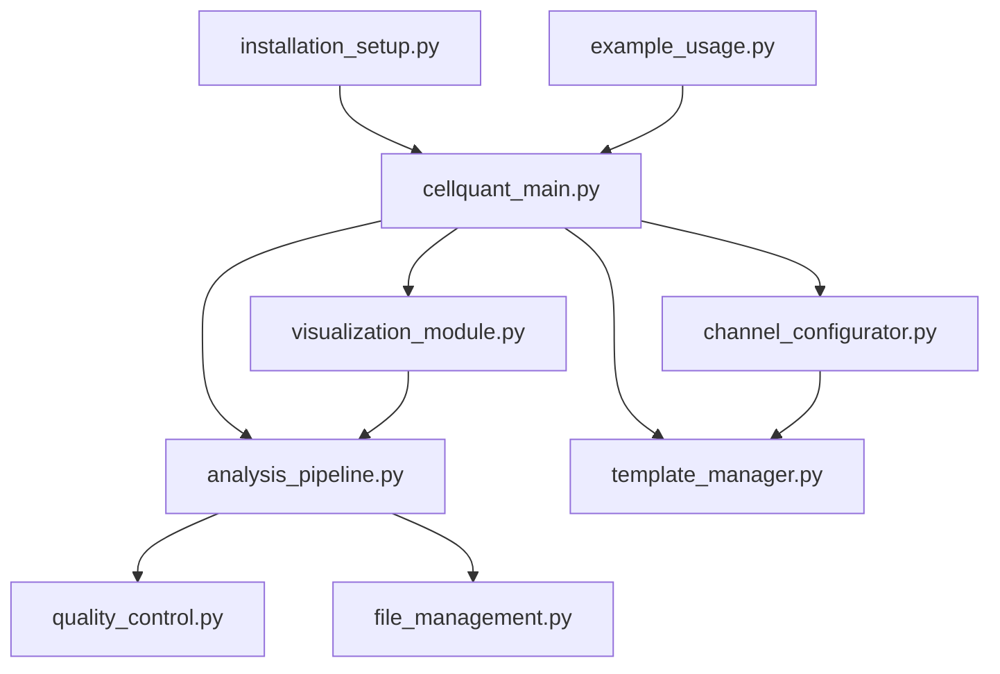

# CellQuantGUI - Comprehensive Developer Documentation

## 📋 Table of Contents

1. [System Overview](#system-overview)
2. [Architecture & Design Principles](#architecture--design-principles)
3. [Codebase Structure](#codebase-structure)
4. [Core Components Deep Dive](#core-components-deep-dive)
5. [Data Flow & Processing Pipeline](#data-flow--processing-pipeline)
6. [Integration Points & APIs](#integration-points--apis)
7. [Extension Guidelines](#extension-guidelines)
8. [Coding Standards & Patterns](#coding-standards--patterns)
9. [Error Handling & Logging](#error-handling--logging)
10. [Testing Strategy](#testing-strategy)
11. [Performance Considerations](#performance-considerations)
12. [Deployment & Installation](#deployment--installation)
13. [Troubleshooting Guide](#troubleshooting-guide)
14. [Future Development Roadmap](#future-development-roadmap)

---

## System Overview

### 🎯 Purpose
CellQuantGUI is a comprehensive quantitative microscopy analysis platform designed for automated cell segmentation and fluorescence quantification. It bridges the gap between complex image analysis algorithms and user-friendly interfaces, enabling biologists to perform rigorous quantitative analysis without programming expertise.

### 🏗️ Core Functionality
- **Multi-channel image processing** - Handles TIFF, PNG, JPEG formats
- **Automated cell segmentation** - Cellpose integration with fallback algorithms
- **Quantitative analysis** - CTCF (Corrected Total Cell Fluorescence) calculations
- **Batch processing** - High-throughput analysis capabilities
- **Statistical analysis** - Built-in statistical testing and visualization
- **Quality control** - Comprehensive validation and reporting
- **Template system** - Pre-configured analysis workflows

### 🎨 Target Users
- **Biologists** - Primary users performing quantitative microscopy
- **Core facilities** - High-throughput analysis services
- **Researchers** - Custom analysis pipeline development
- **Developers** - Extension and customization

---

## Architecture & Design Principles

### 🏛️ Architectural Pattern
The system follows a **modular, event-driven architecture** with clear separation of concerns:

```
┌─────────────────┐    ┌─────────────────┐    ┌─────────────────┐
│   GUI Layer     │    │  Analysis Core  │    │  Data Layer     │
│ (User Interface)│◄──►│  (Processing)   │◄──►│ (I/O & Storage) │
└─────────────────┘    └─────────────────┘    └─────────────────┘
```

### 🎯 Design Principles

#### 1. **Modularity**
- Each component has a single, well-defined responsibility
- Loose coupling between modules enables independent development
- Clear interfaces between components

#### 2. **Extensibility**
- Plugin architecture for new analysis algorithms
- Template system for custom workflows
- Hook points for custom processing steps

#### 3. **Robustness**
- Comprehensive error handling with graceful degradation
- Multiple fallback mechanisms (e.g., Cellpose → scikit-image)
- Input validation at every level

#### 4. **User Experience**
- Progressive disclosure - simple interface with advanced options
- Real-time feedback and progress indicators
- Comprehensive help and documentation

#### 5. **Scientific Rigor**
- Reproducible analysis with versioned configurations
- Quality control metrics and validation
- Statistical analysis integration

---

## Codebase Structure

### 📁 File Organization

```
CellQuantGUI/
├── cellquant_main.py              # Main GUI application & entry point
├── analysis_pipeline.py           # Core analysis engine
├── channel_configurator.py        # Channel setup & configuration dialogs
├── visualization_module.py        # Data visualization & plotting
├── template_manager.py           # Analysis templates & workflows
├── file_management.py            # File operations & batch processing
├── quality_control.py           # Quality assurance & validation
├── installation_setup.py        # Installation & dependency management
├── example_usage.py             # Usage examples & integration demos
├── launch_cellquant.py          # Application launcher
└── README.md                    # User documentation
```

### 🎯 Module Dependencies



### 🔧 External Dependencies

#### Core Dependencies
```python
# Image processing
numpy >= 1.21.0
pillow >= 8.0.0
scikit-image >= 0.19.0
opencv-python >= 4.5.0

# Data analysis
pandas >= 1.3.0
matplotlib >= 3.5.0
seaborn >= 0.11.0

# Machine learning
cellpose >= 4.0.0
torch >= 1.9.0
torchvision >= 0.10.0

# GUI
tkinter (built-in Python)
```

#### Optional Dependencies
```python
# Advanced visualization
plotly >= 5.0.0
napari >= 0.4.0

# Statistical analysis
scipy >= 1.7.0
statsmodels >= 0.13.0

# Parallel processing
joblib >= 1.1.0
```

---

## Core Components Deep Dive

### 🖥️ 1. Main GUI Application (`cellquant_main.py`)

#### Purpose
Central orchestrator that manages the user interface and coordinates all other components.

#### Key Classes

##### `MainApplication`
- **Role**: Primary GUI controller
- **Responsibility**: User interface management, event handling, application state
- **Key Methods**:
  - `setup_gui()` - Initialize GUI components
  - `start_analysis()` - Coordinate analysis pipeline execution
  - `add_condition_to_experiment()` - Manage experimental conditions

##### `ExperimentConfig` (dataclass)
- **Role**: Experiment configuration container
- **Responsibility**: Store and serialize experiment parameters
- **Key Attributes**:
  - `conditions`: List of experimental conditions
  - `analysis_parameters`: Analysis settings
  - `output_directory`: Results storage location

##### `Condition` (dataclass)
- **Role**: Experimental condition container
- **Responsibility**: Store condition-specific parameters
- **Key Attributes**:
  - `channels`: List of microscopy channels
  - `directory`: Image file location
  - `description`: Condition description

##### `ChannelInfo` (dataclass)
- **Role**: Channel configuration container
- **Responsibility**: Store channel-specific parameters
- **Key Attributes**:
  - `type`: Channel type (nuclear, cellular, organelle)
  - `purpose`: Usage purpose (segmentation, quantification)
  - `wavelength`: Excitation/emission wavelength

#### GUI Structure
```
MainWindow
├── MenuBar
│   ├── File Menu (New, Load, Save, Export)
│   ├── Edit Menu (Preferences, Templates)
│   └── Help Menu (Documentation, About)
├── TabNotebook
│   ├── Experiment Tab (Configuration)
│   ├── Analysis Tab (Processing)
│   └── Results Tab (Visualization)
└── StatusBar (Progress, Messages)
```

#### Event Flow
1. **User Input** → GUI Event Handler
2. **Validation** → Configuration Update
3. **Action Execution** → Backend Component
4. **Result Processing** → GUI Update
5. **User Feedback** → Status/Progress Display

### 🔬 2. Analysis Pipeline (`analysis_pipeline.py`)

#### Purpose
Core analysis engine that processes images and generates quantitative measurements.

#### Key Classes

##### `AnalysisPipeline`
- **Role**: Main analysis orchestrator
- **Responsibility**: Coordinate image processing, segmentation, and quantification
- **Key Methods**:
  - `run_analysis()` - Execute complete analysis workflow
  - `_process_condition()` - Process single experimental condition
  - `_segment_cells()` - Perform cell segmentation
  - `_quantify_fluorescence()` - Calculate fluorescence measurements

##### `SegmentationEngine`
- **Role**: Cell segmentation handler
- **Responsibility**: Cellpose integration with fallback mechanisms
- **Key Methods**:
  - `segment_cells()` - Primary segmentation interface
  - `_fallback_segmentation()` - Backup segmentation method
- **Design Pattern**: Strategy pattern with fallback chain

##### `AnalysisParameters`
- **Role**: Parameter validation and defaults
- **Responsibility**: Ensure valid analysis configuration
- **Key Methods**:
  - `validate_parameters()` - Parameter validation
  - `get_default_config()` - Default parameter sets

#### Processing Workflow
```
Image Loading → Channel Assignment → Quality Check →
Cell Segmentation → ROI Extraction → Fluorescence Quantification →
Statistical Analysis → Results Export → Quality Control
```

#### Segmentation Strategy
```python
# Primary: Cellpose v4.0+ API
try:
    model = models.CellposeModel(model_type=model_type)
    masks = model.eval(image, diameter=diameter)
except CellposeError:
    # Fallback: scikit-image watershed
    masks = watershed_segmentation(image)
except Exception:
    # Final fallback: simple thresholding
    masks = threshold_segmentation(image)
```

### 🎛️ 3. Channel Configurator (`channel_configurator.py`)

#### Purpose
Handles assignment of channel types and quantification parameters through user-friendly dialogs.

#### Key Classes

##### `ChannelConfigurator`
- **Role**: Channel configuration dialog
- **Responsibility**: Map image files to biological channels
- **Key Methods**:
  - `auto_detect_channels()` - Automatic channel detection
  - `group_files_by_channel()` - File grouping by channel suffix
  - `extract_channel_suffix()` - Pattern-based channel identification

##### `ConditionManager`
- **Role**: Condition setup workflow
- **Responsibility**: Guide users through condition configuration
- **Key Methods**:
  - `add_condition_dialog()` - Condition creation workflow
  - `get_images_from_directory()` - Image file discovery

#### Channel Detection Logic
```python
# Pattern recognition for channel suffixes
patterns = [
    r'[_\-]C(\d+)\.tiff?$',        # _C0.tif, _C1.tiff
    r'[_\-]c(\d+)\.tiff?$',        # _c0.tif, _c1.tiff  
    r'[_\-]CH(\d+)\.tiff?$',       # _CH0.tif, _CH1.tiff
    r'[_\-]channel(\d+)\.tiff?$',  # _channel0.tif
]

# Smart defaults based on channel number
channel_defaults = {
    'C0': {'type': 'nuclear', 'purpose': 'segmentation'},
    'C1': {'type': 'cellular', 'purpose': 'quantification'},
    'C2': {'type': 'cellular', 'purpose': 'quantification'},
    'C3': {'type': 'cellular', 'purpose': 'quantification'},
}
```

### 📊 4. Visualization Module (`visualization_module.py`)

#### Purpose
Generates publication-ready plots and interactive visualizations.

#### Key Classes

##### `VisualizationEngine`
- **Role**: Plot generation coordinator
- **Responsibility**: Create statistical plots and visualizations
- **Key Methods**:
  - `create_condition_comparison_plots()` - Statistical comparisons
  - `create_correlation_matrix()` - Multi-parameter correlations
  - `create_statistical_report()` - Comprehensive analysis reports

##### `InteractiveVisualization`
- **Role**: GUI-embedded plotting
- **Responsibility**: Real-time plot updates and interaction
- **Key Methods**:
  - `create_embedded_plot()` - Matplotlib-tkinter integration
  - `create_live_progress_plot()` - Real-time progress visualization

#### Plot Types
- **Box plots** - Condition comparisons with statistical significance
- **Scatter plots** - Parameter correlations and relationships
- **Heatmaps** - Multi-condition, multi-parameter overview
- **Histograms** - Distribution analysis
- **Time series** - Batch processing progress

### 📝 5. Template Manager (`template_manager.py`)

#### Purpose
Manages pre-configured analysis workflows for common experimental setups.

#### Key Classes

##### `AnalysisTemplate` (dataclass)
- **Role**: Template configuration container
- **Responsibility**: Store reusable analysis configurations
- **Key Attributes**:
  - `channel_template`: Channel configuration preset
  - `analysis_parameters`: Analysis parameter preset
  - `file_patterns`: Expected file naming patterns

##### `TemplateManager`
- **Role**: Template lifecycle management
- **Responsibility**: Create, save, load, and apply templates
- **Key Methods**:
  - `create_builtin_templates()` - Standard analysis templates
  - `apply_template_to_condition()` - Template application
  - `get_template_suggestions()` - Smart template recommendations

#### Built-in Templates
- **DNA Damage Analysis** - γH2AX foci quantification
- **Mitochondrial Analysis** - Mitochondrial morphology and function
- **Protein Localization** - Subcellular localization analysis
- **Cell Cycle Analysis** - Cell cycle phase quantification
- **Apoptosis Analysis** - Apoptotic marker quantification

### 📁 6. File Management (`file_management.py`)

#### Purpose
Handles file organization, batch operations, and data management.

#### Key Classes

##### `FileManager`
- **Role**: File system operations coordinator
- **Responsibility**: File discovery, validation, and organization
- **Key Methods**:
  - `scan_directory()` - Recursive file discovery
  - `validate_file_integrity()` - File corruption detection
  - `organize_files()` - Automatic file organization

##### `BatchProcessor`
- **Role**: Batch analysis coordinator
- **Responsibility**: Queue management and parallel processing
- **Key Methods**:
  - `create_batch_job()` - Job creation and queuing
  - `start_batch_job()` - Parallel execution management

##### `DataArchiver`
- **Role**: Data backup and archiving
- **Responsibility**: Long-term data storage and retrieval
- **Key Methods**:
  - `create_archive()` - Compressed archive creation
  - `restore_archive()` - Archive restoration

### 🔍 7. Quality Control (`quality_control.py`)

#### Purpose
Ensures data quality and analysis reliability through comprehensive validation.

#### Key Classes

##### `QualityControlManager`
- **Role**: Quality assurance coordinator
- **Responsibility**: Orchestrate all quality control checks
- **Key Methods**:
  - `generate_quality_report()` - Comprehensive quality assessment
  - `create_quality_visualization()` - Quality metrics visualization

##### `ImageQualityAnalyzer`
- **Role**: Image quality assessment
- **Responsibility**: Evaluate image quality metrics
- **Key Metrics**:
  - Signal-to-noise ratio (SNR)
  - Image contrast and sharpness
  - Saturation detection
  - Noise level estimation

##### `SegmentationQualityChecker`
- **Role**: Segmentation validation
- **Responsibility**: Assess segmentation accuracy
- **Key Metrics**:
  - Cell coverage percentage
  - Cell morphology analysis
  - Boundary quality assessment
  - Segmentation issue detection

##### `DataQualityValidator`
- **Role**: Measurement validation
- **Responsibility**: Validate quantitative measurements
- **Key Checks**:
  - Data completeness
  - Outlier detection
  - Distribution validation
  - Systematic bias detection

---

## Data Flow & Processing Pipeline

### 🔄 High-Level Data Flow

```
Raw Images → Configuration → Processing → Analysis → Results → Export
     ↓             ↓            ↓          ↓         ↓        ↓
File Discovery → Channel Map → Segmentation → CTCF → Stats → Reports
```

### 📊 Detailed Processing Pipeline

#### 1. **Input Stage**
```python
# File discovery and validation
image_files = file_manager.scan_directory(input_dir)
validated_files = file_manager.validate_file_integrity(image_files)
channel_groups = channel_configurator.group_files_by_channel(validated_files)
```

#### 2. **Configuration Stage**
```python
# Channel assignment and parameter setup
channels = channel_configurator.configure_channels(channel_groups)
analysis_params = template_manager.apply_template(template_id)
experiment_config = ExperimentConfig(channels=channels, params=analysis_params)
```

#### 3. **Processing Stage**
```python
# Image processing and segmentation
for condition in experiment_config.conditions:
    for image_group in condition.images:
        # Load multi-channel image
        image_data = load_image_group(image_group, condition.channels)
        
        # Quality control check
        quality_metrics = quality_analyzer.analyze_image_quality(image_data)
        
        # Cell segmentation
        segmentation_image = select_segmentation_channel(image_data)
        masks = segmentation_engine.segment_cells(segmentation_image)
        
        # ROI extraction
        cell_rois = extract_rois(masks)
        
        # Fluorescence quantification
        measurements = quantify_fluorescence(image_data, cell_rois, condition.channels)
```

#### 4. **Analysis Stage**
```python
# Statistical analysis and quality control
results = analysis_pipeline.run_analysis(experiment_config)
quality_report = quality_control.generate_quality_report(results)
statistical_analysis = perform_statistical_tests(results)
```

#### 5. **Output Stage**
```python
# Results export and visualization
export_csv(results.cell_data)
export_images(results.processed_images)
visualization_engine.create_all_plots(results)
generate_final_report(results, quality_report)
```

### 🔀 Data Structures

#### Core Data Types
```python
# Image data representation
ImageData = Dict[str, np.ndarray]  # channel_name -> image_array

# Cell measurements
CellMeasurement = Dict[str, Union[float, int, str]]
# Example: {
#     'cell_id': 1,
#     'condition': 'Control',
#     'area': 156.7,
#     'DAPI_ctcf': 12345.6,
#     'GFP_ctcf': 8901.2
# }

# Analysis results
AnalysisResults = Dict[str, Any]
# Structure: {
#     'experiment_info': {...},
#     'conditions': {...},
#     'summary_statistics': {...},
#     'quality_metrics': {...}
# }
```

#### File Organization
```
project_directory/
├── data/
│   ├── condition1/
│   │   ├── image1_C0.tiff  # DAPI
│   │   ├── image1_C1.tiff  # Channel 1
│   │   └── ...
│   └── condition2/
│       └── ...
├── results/
│   ├── cell_data.csv
│   ├── condition_summaries.csv
│   ├── plots/
│   └── quality_report.html
├── configs/
│   └── experiment_config.json
└── logs/
    └── analysis.log
```

---

## Integration Points & APIs

### 🔗 Component Interfaces

#### 1. GUI ↔ Analysis Pipeline
```python
# Interface for analysis execution
class AnalysisPipelineInterface:
    def run_analysis(self, config: Dict, progress_callback: Callable) -> Dict:
        """Execute analysis with progress updates"""
        pass
    
    def validate_configuration(self, config: Dict) -> List[str]:
        """Validate configuration and return error messages"""
        pass
```

#### 2. Analysis Pipeline ↔ Segmentation Engine
```python
# Interface for cell segmentation
class SegmentationInterface:
    def segment_cells(self, image: np.ndarray, 
                     model_type: str = 'cyto2',
                     diameter: Optional[float] = None) -> Tuple[np.ndarray, List[Dict]]:
        """Segment cells and return masks + ROI data"""
        pass
```

#### 3. Template System ↔ Configuration
```python
# Interface for template application
class TemplateInterface:
    def apply_template(self, template_id: str, 
                      condition_config: Dict) -> Dict:
        """Apply template configuration to condition"""
        pass
    
    def suggest_templates(self, image_filenames: List[str]) -> List[str]:
        """Suggest appropriate templates based on file patterns"""
        pass
```

### 🔌 Extension Points

#### 1. Custom Segmentation Algorithms
```python
# Base class for custom segmentation methods
class BaseSegmentationMethod:
    def __init__(self, **kwargs):
        self.parameters = kwargs
    
    def segment(self, image: np.ndarray) -> np.ndarray:
        """Implement custom segmentation logic"""
        raise NotImplementedError
    
    def validate_parameters(self) -> bool:
        """Validate method-specific parameters"""
        return True

# Registration system
segmentation_registry = {}

def register_segmentation_method(name: str, method_class: Type[BaseSegmentationMethod]):
    """Register new segmentation method"""
    segmentation_registry[name] = method_class
```

#### 2. Custom Analysis Modules
```python
# Base class for analysis modules
class BaseAnalysisModule:
    def __init__(self, name: str, version: str):
        self.name = name
        self.version = version
    
    def process(self, image_data: Dict[str, np.ndarray], 
               rois: List[Dict]) -> Dict[str, Any]:
        """Implement custom analysis logic"""
        raise NotImplementedError
    
    def get_parameters(self) -> Dict[str, Any]:
        """Return module-specific parameters"""
        return {}

# Plugin system
analysis_plugins = {}

def register_analysis_plugin(plugin: BaseAnalysisModule):
    """Register new analysis plugin"""
    analysis_plugins[plugin.name] = plugin
```

#### 3. Custom Export Formats
```python
# Base class for export formats
class BaseExporter:
    def __init__(self, format_name: str, file_extension: str):
        self.format_name = format_name
        self.file_extension = file_extension
    
    def export(self, data: Any, output_path: Path) -> bool:
        """Export data in custom format"""
        raise NotImplementedError

# Exporter registry
export_registry = {}

def register_exporter(exporter: BaseExporter):
    """Register new export format"""
    export_registry[exporter.format_name] = exporter
```

### 🔄 Event System

#### Event Types
```python
from enum import Enum

class EventType(Enum):
    ANALYSIS_STARTED = "analysis_started"
    ANALYSIS_PROGRESS = "analysis_progress"
    ANALYSIS_COMPLETED = "analysis_completed"
    ANALYSIS_ERROR = "analysis_error"
    SEGMENTATION_COMPLETED = "segmentation_completed"
    EXPORT_COMPLETED = "export_completed"

# Event handling
class EventManager:
    def __init__(self):
        self.listeners = defaultdict(list)
    
    def subscribe(self, event_type: EventType, callback: Callable):
        """Subscribe to events"""
        self.listeners[event_type].append(callback)
    
    def emit(self, event_type: EventType, data: Any = None):
        """Emit event to all subscribers"""
        for callback in self.listeners[event_type]:
            callback(data)
```

---

## Extension Guidelines

### 🛠️ Adding New Features

#### 1. **New Analysis Algorithms**

**Step 1: Create Algorithm Class**
```python
# File: custom_algorithms.py
from analysis_pipeline import BaseAnalysisModule

class CustomFociCounter(BaseAnalysisModule):
    def __init__(self):
        super().__init__("Foci Counter", "1.0.0")
        self.parameters = {
            'min_foci_size': 2,
            'max_foci_size': 50,
            'intensity_threshold': 0.5
        }
    
    def process(self, image_data, rois):
        # Implement foci counting logic
        results = {}
        for roi in rois:
            foci_count = self.count_foci(image_data, roi)
            results[roi['label']] = {'foci_count': foci_count}
        return results
```

**Step 2: Register Algorithm**
```python
# In analysis_pipeline.py
from custom_algorithms import CustomFociCounter

# Register the new algorithm
register_analysis_plugin(CustomFociCounter())
```

**Step 3: Add GUI Integration**
```python
# In cellquant_main.py - add to analysis parameters
self.foci_counting_var = tk.BooleanVar()
ttk.Checkbutton(analysis_frame, text="Count Foci", 
                variable=self.foci_counting_var).pack()
```

#### 2. **New Visualization Types**

**Step 1: Extend VisualizationEngine**
```python
# In visualization_module.py
def create_custom_plot_type(self, data, plot_type="custom"):
    """Add new plot type"""
    fig, ax = plt.subplots(figsize=(10, 6))
    
    # Implement custom plotting logic
    if plot_type == "radial_profile":
        self._create_radial_profile_plot(ax, data)
    elif plot_type == "colocalization":
        self._create_colocalization_plot(ax, data)
    
    return fig
```

**Step 2: Add GUI Controls**
```python
# Add to results tab
plot_type_var = tk.StringVar(value="standard")
plot_options = ["standard", "radial_profile", "colocalization"]
ttk.Combobox(results_frame, textvariable=plot_type_var, 
             values=plot_options).pack()
```

#### 3. **New File Formats**

**Step 1: Extend File Loading**
```python
# In analysis_pipeline.py
def _load_custom_format(self, filepath: Path) -> np.ndarray:
    """Load custom file format"""
    if filepath.suffix.lower() == '.nd2':
        return self._load_nd2_file(filepath)
    elif filepath.suffix.lower() == '.lsm':
        return self._load_lsm_file(filepath)
    else:
        raise ValueError(f"Unsupported format: {filepath.suffix}")
```

**Step 2: Update File Discovery**
```python
# In file_management.py - add to supported extensions
supported_extensions = {'.tif', '.tiff', '.png', '.jpg', '.jpeg', 
                       '.nd2', '.lsm', '.czi'}  # Add new formats
```

### 🧪 Testing New Features

#### Unit Testing Template
```python
# tests/test_custom_feature.py
import unittest
from custom_algorithms import CustomFociCounter

class TestCustomFociCounter(unittest.TestCase):
    def setUp(self):
        self.algorithm = CustomFociCounter()
        self.test_image = np.random.rand(100, 100, 3) * 255
        self.test_rois = [{'label': 1, 'coords': np.array([[50, 50]])}]
    
    def test_foci_counting(self):
        """Test foci counting functionality"""
        results = self.algorithm.process(
            {'test_channel': self.test_image}, 
            self.test_rois
        )
        
        self.assertIn(1, results)
        self.assertIn('foci_count', results[1])
        self.assertIsInstance(results[1]['foci_count'], int)
    
    def test_parameter_validation(self):
        """Test parameter validation"""
        self.assertTrue(self.algorithm.validate_parameters())

if __name__ == '__main__':
    unittest.main()
```

#### Integration Testing
```python
# tests/test_integration.py
def test_end_to_end_analysis():
    """Test complete analysis pipeline with new feature"""
    
    # Setup test configuration
    config = {
        'experiment_name': 'Test_Custom_Feature',
        'conditions': [...],
        'custom_algorithms': ['foci_counter']
    }
    
    # Run analysis
    pipeline = AnalysisPipeline(config)
    results = pipeline.run_analysis()
    
    # Verify custom algorithm results
    assert 'foci_count' in results['conditions']['test']['cell_data'][0]
```

### 📋 Code Review Checklist

Before submitting new features:

#### ✅ **Functionality**
- [ ] Feature works as intended
- [ ] Error handling implemented
- [ ] Edge cases considered
- [ ] Performance implications evaluated

#### ✅ **Integration**
- [ ] Follows existing patterns
- [ ] No breaking changes to existing APIs
- [ ] Proper event handling
- [ ] GUI integration (if applicable)

#### ✅ **Quality**
- [ ] Code follows style guidelines
- [ ] Comprehensive documentation
- [ ] Unit tests included
- [ ] Integration tests pass
- [ ] No security vulnerabilities

#### ✅ **User Experience**
- [ ] Intuitive interface design
- [ ] Appropriate defaults
- [ ] Clear error messages
- [ ] Progress feedback

---

## Coding Standards & Patterns

### 🎨 Code Style Guidelines

#### Python Style (PEP 8 Compliant)
```python
# Class names: PascalCase
class AnalysisPipeline:
    pass

# Function/method names: snake_case
def process_image_data():
    pass

# Constants: UPPER_SNAKE_CASE
DEFAULT_CELL_DIAMETER = 30
SUPPORTED_IMAGE_FORMATS = ['.tif', '.tiff', '.png']

# Private methods: _leading_underscore
def _internal_helper_method():
    pass
```

#### Documentation Standards
```python
def calculate_ctcf(image: np.ndarray, coordinates: np.ndarray, 
                  background: float) -> float:
    """
    Calculate Corrected Total Cell Fluorescence (CTCF).
    
    CTCF is calculated as: Integrated Density - (Area × Background)
    This corrects for background fluorescence and provides a measure
    of total fluorescence signal within the cell region.
    
    Args:
        image: 2D numpy array containing fluorescence intensities
        coordinates: Nx2 array of pixel coordinates defining the cell region
        background: Background fluorescence value to subtract
    
    Returns:
        float: CTCF value for the specified region
    
    Raises:
        ValueError: If coordinates are outside image bounds
        TypeError: If image is not 2D numpy array
    
    Example:
        >>> image = np.random.rand(100, 100) * 255
        >>> coords = np.array([[50, 50], [51, 50], [50, 51]])
        >>> bg = 10.0
        >>> ctcf = calculate_ctcf(image, coords, bg)
        >>> print(f"CTCF: {ctcf:.2f}")
    """
    # Implementation here
    pass
```

#### Type Hints
```python
from typing import Dict, List, Optional, Union, Tuple, Callable, Any
from pathlib import Path
import numpy as np
import pandas as pd

# Function signatures with type hints
def process_condition(condition: Dict[str, Any], 
                     progress_callback: Optional[Callable[[str, int], None]] = None
                     ) -> Tuple[List[Dict], Dict[str, float]]:
    """Process experimental condition with optional progress updates."""
    pass

# Class with type hints
class ImageProcessor:
    def __init__(self, supported_formats: List[str]):
        self.supported_formats: List[str] = supported_formats
        self.processed_count: int = 0
    
    def load_image(self, filepath: Path) -> np.ndarray:
        """Load image from file."""
        pass
```

### 🏗️ Design Patterns Used

#### 1. **Strategy Pattern** (Segmentation Methods)
```python
# Abstract base class
class SegmentationStrategy:
    def segment(self, image: np.ndarray) -> np.ndarray:
        raise NotImplementedError

# Concrete strategies
class CellposeSegmentation(SegmentationStrategy):
    def segment(self, image: np.ndarray) -> np.ndarray:
        # Cellpose implementation
        pass

class WatershedSegmentation(SegmentationStrategy):
    def segment(self, image: np.ndarray) -> np.ndarray:
        # Watershed implementation
        pass

# Context class
class SegmentationEngine:
    def __init__(self):
        self.strategies = {
            'cellpose': CellposeSegmentation(),
            'watershed': WatershedSegmentation()
        }
    
    def segment_cells(self, image: np.ndarray, method: str) -> np.ndarray:
        return self.strategies[method].segment(image)
```

#### 2. **Observer Pattern** (Event System)
```python
class Observable:
    def __init__(self):
        self._observers: List[Callable] = []
    
    def add_observer(self, observer: Callable):
        self._observers.append(observer)
    
    def notify_observers(self, data: Any):
        for observer in self._observers:
            observer(data)

class AnalysisPipeline(Observable):
    def run_analysis(self):
        self.notify_observers({"event": "analysis_started"})
        # ... analysis logic ...
        self.notify_observers({"event": "analysis_completed", "results": results})
```

#### 3. **Factory Pattern** (Template Creation)
```python
class TemplateFactory:
    _template_creators = {}
    
    @classmethod
    def register_template(cls, template_type: str, creator: Callable):
        cls._template_creators[template_type] = creator
    
    @classmethod
    def create_template(cls, template_type: str, **kwargs) -> AnalysisTemplate:
        creator = cls._template_creators.get(template_type)
        if not creator:
            raise ValueError(f"Unknown template type: {template_type}")
        return creator(**kwargs)

# Register built-in templates
TemplateFactory.register_template("dna_damage", create_dna_damage_template)
TemplateFactory.register_template("mitochondrial", create_mitochondrial_template)
```

#### 4. **Chain of Responsibility** (Error Handling)
```python
class ErrorHandler:
    def __init__(self, next_handler=None):
        self.next_handler = next_handler
    
    def handle(self, error: Exception) -> bool:
        if self.can_handle(error):
            return self.process_error(error)
        elif self.next_handler:
            return self.next_handler.handle(error)
        return False
    
    def can_handle(self, error: Exception) -> bool:
        raise NotImplementedError
    
    def process_error(self, error: Exception) -> bool:
        raise NotImplementedError

# Concrete handlers
class FileNotFoundHandler(ErrorHandler):
    def can_handle(self, error: Exception) -> bool:
        return isinstance(error, FileNotFoundError)
    
    def process_error(self, error: Exception) -> bool:
        logger.warning(f"File not found: {error}")
        return True  # Error handled

class CellposeErrorHandler(ErrorHandler):
    def can_handle(self, error: Exception) -> bool:
        return "cellpose" in str(error).lower()
    
    def process_error(self, error: Exception) -> bool:
        logger.warning("Cellpose failed, falling back to watershed segmentation")
        return False  # Continue to fallback
```

### 📊 Data Validation Patterns

#### Input Validation
```python
def validate_image_data(image: np.ndarray) -> None:
    """Validate image data format and content."""
    if not isinstance(image, np.ndarray):
        raise TypeError("Image must be numpy array")
    
    if image.ndim not in [2, 3]:
        raise ValueError(f"Image must be 2D or 3D, got {image.ndim}D")
    
    if image.dtype not in [np.uint8, np.uint16, np.float32, np.float64]:
        raise ValueError(f"Unsupported image dtype: {image.dtype}")
    
    if np.any(np.isnan(image)):
        raise ValueError("Image contains NaN values")

def validate_configuration(config: Dict) -> List[str]:
    """Validate experiment configuration."""
    errors = []
    
    # Required fields
    for field in ['experiment_name', 'conditions', 'output_directory']:
        if field not in config:
            errors.append(f"Missing required field: {field}")
    
    # Validate conditions
    if 'conditions' in config:
        for i, condition in enumerate(config['conditions']):
            if 'channels' not in condition:
                errors.append(f"Condition {i}: Missing channels configuration")
    
    return errors
```

---

## Error Handling & Logging

### 🚨 Error Handling Strategy

#### Hierarchical Error Handling
```python
# Top level: Application errors
class CellQuantError(Exception):
    """Base exception for CellQuantGUI"""
    pass

# Second level: Component-specific errors
class AnalysisError(CellQuantError):
    """Analysis pipeline errors"""
    pass

class SegmentationError(AnalysisError):
    """Cell segmentation errors"""
    pass

class QuantificationError(AnalysisError):
    """Fluorescence quantification errors"""
    pass

class ConfigurationError(CellQuantError):
    """Configuration and setup errors"""
    pass

# Third level: Specific error types
class CellposeNotAvailableError(SegmentationError):
    """Cellpose not installed or not working"""
    pass

class InvalidImageFormatError(AnalysisError):
    """Unsupported or corrupted image format"""
    pass
```

#### Error Recovery Mechanisms
```python
def robust_analysis_execution(config: Dict) -> Dict:
    """Execute analysis with comprehensive error recovery."""
    
    try:
        # Primary analysis path
        return execute_primary_analysis(config)
    
    except CellposeNotAvailableError:
        logger.warning("Cellpose unavailable, using fallback segmentation")
        config['segmentation_method'] = 'watershed'
        return execute_analysis_with_fallback(config)
    
    except InvalidImageFormatError as e:
        logger.error(f"Image format error: {e}")
        # Attempt format conversion
        try:
            converted_images = convert_image_formats(config['image_paths'])
            config['image_paths'] = converted_images
            return execute_primary_analysis(config)
        except Exception:
            raise AnalysisError("Unable to process images") from e
    
    except MemoryError:
        logger.warning("Insufficient memory, reducing batch size")
        config['batch_size'] = config.get('batch_size', 10) // 2
        if config['batch_size'] < 1:
            raise AnalysisError("Insufficient memory even with minimal batch size")
        return execute_primary_analysis(config)
    
    except Exception as e:
        logger.error(f"Unexpected error in analysis: {e}")
        raise AnalysisError("Analysis failed due to unexpected error") from e
```

### 📝 Logging Configuration

#### Logging Setup
```python
import logging
import logging.handlers
from pathlib import Path
from datetime import datetime

def setup_logging(log_dir: Path, log_level: str = "INFO") -> logging.Logger:
    """Configure comprehensive logging system."""
    
    log_dir.mkdir(exist_ok=True)
    
    # Create formatters
    detailed_formatter = logging.Formatter(
        fmt='%(asctime)s - %(name)s - %(levelname)s - %(funcName)s:%(lineno)d - %(message)s',
        datefmt='%Y-%m-%d %H:%M:%S'
    )
    
    simple_formatter = logging.Formatter(
        fmt='%(asctime)s - %(levelname)s - %(message)s',
        datefmt='%H:%M:%S'
    )
    
    # Configure root logger
    root_logger = logging.getLogger()
    root_logger.setLevel(getattr(logging, log_level.upper()))
    
    # File handler - detailed logs
    file_handler = logging.handlers.RotatingFileHandler(
        log_dir / f"cellquant_{datetime.now().strftime('%Y%m%d')}.log",
        maxBytes=10*1024*1024,  # 10MB
        backupCount=5
    )
    file_handler.setFormatter(detailed_formatter)
    file_handler.setLevel(logging.DEBUG)
    
    # Console handler - simplified logs
    console_handler = logging.StreamHandler()
    console_handler.setFormatter(simple_formatter)
    console_handler.setLevel(getattr(logging, log_level.upper()))
    
    # Error file handler - errors only
    error_handler = logging.FileHandler(log_dir / "errors.log")
    error_handler.setFormatter(detailed_formatter)
    error_handler.setLevel(logging.ERROR)
    
    # Add handlers
    root_logger.addHandler(file_handler)
    root_logger.addHandler(console_handler)
    root_logger.addHandler(error_handler)
    
    return root_logger

# Usage in application
logger = setup_logging(Path("logs"))
```

#### Contextual Logging
```python
import contextlib
from typing import Generator

@contextlib.contextmanager
def log_analysis_context(condition_name: str, image_name: str) -> Generator[logging.Logger, None, None]:
    """Provide contextual logging for analysis operations."""
    
    logger = logging.getLogger(__name__)
    
    # Create context-specific logger
    context_logger = logging.LoggerAdapter(logger, {
        'condition': condition_name,
        'image': image_name
    })
    
    try:
        context_logger.info("Starting analysis")
        yield context_logger
        context_logger.info("Analysis completed successfully")
    
    except Exception as e:
        context_logger.error(f"Analysis failed: {e}")
        raise
    
    finally:
        context_logger.debug("Cleaning up analysis context")

# Usage
with log_analysis_context("Control", "image_001.tiff") as logger:
    logger.info("Loading image data")
    # ... analysis operations ...
    logger.info("Segmentation completed")
```

#### Performance Logging
```python
import time
import functools
from typing import Callable, Any

def log_performance(func: Callable) -> Callable:
    """Decorator to log function execution time and memory usage."""
    
    @functools.wraps(func)
    def wrapper(*args, **kwargs) -> Any:
        logger = logging.getLogger(func.__module__)
        
        start_time = time.time()
        start_memory = get_memory_usage()  # Custom function
        
        try:
            result = func(*args, **kwargs)
            
            end_time = time.time()
            end_memory = get_memory_usage()
            
            execution_time = end_time - start_time
            memory_delta = end_memory - start_memory
            
            logger.info(f"{func.__name__} completed in {execution_time:.2f}s, "
                       f"memory delta: {memory_delta:.2f}MB")
            
            return result
        
        except Exception as e:
            logger.error(f"{func.__name__} failed after {time.time() - start_time:.2f}s: {e}")
            raise
    
    return wrapper

# Usage
@log_performance
def segment_cells(image: np.ndarray) -> np.ndarray:
    # Segmentation logic here
    pass
```

---

## Testing Strategy

### 🧪 Testing Framework

#### Test Organization
```
tests/
├── unit/                    # Unit tests for individual components
│   ├── test_analysis_pipeline.py
│   ├── test_segmentation.py
│   ├── test_quantification.py
│   └── test_quality_control.py
├── integration/             # Integration tests for component interaction
│   ├── test_gui_integration.py
│   ├── test_pipeline_integration.py
│   └── test_export_integration.py
├── system/                  # End-to-end system tests
│   ├── test_complete_workflow.py
│   └── test_batch_processing.py
├── fixtures/                # Test data and fixtures
│   ├── sample_images/
│   ├── test_configs/
│   └── expected_results/
└── utils/                   # Test utilities
    ├── test_helpers.py
    └── mock_data_generators.py
```

#### Unit Testing Template
```python
import unittest
import numpy as np
from unittest.mock import Mock, patch, MagicMock
from pathlib import Path

from analysis_pipeline import AnalysisPipeline, SegmentationEngine
from cellquant_main import ExperimentConfig

class TestAnalysisPipeline(unittest.TestCase):
    """Test cases for AnalysisPipeline class."""
    
    def setUp(self):
        """Set up test fixtures."""
        self.test_config = {
            'experiment_name': 'Test_Experiment',
            'output_directory': '/tmp/test_output',
            'conditions': [
                {
                    'name': 'Control',
                    'directory': '/tmp/test_images',
                    'channels': [
                        {
                            'name': 'DAPI',
                            'type': 'nuclear',
                            'purpose': 'segmentation'
                        }
                    ]
                }
            ]
        }
        
        self.pipeline = AnalysisPipeline(self.test_config)
        
        # Create mock image data
        self.mock_image = np.random.randint(0, 255, (100, 100), dtype=np.uint8)
        self.mock_masks = np.random.randint(0, 10, (100, 100), dtype=np.uint16)
    
    def test_initialization(self):
        """Test pipeline initialization."""
        self.assertEqual(self.pipeline.config['experiment_name'], 'Test_Experiment')
        self.assertIsNotNone(self.pipeline.results)
    
    def test_configuration_validation(self):
        """Test configuration validation."""
        # Valid configuration
        self.assertTrue(self.pipeline._validate_configuration())
        
        # Invalid configuration - missing conditions
        invalid_config = {'experiment_name': 'Test'}
        pipeline = AnalysisPipeline(invalid_config)
        
        with self.assertRaises(ValueError):
            pipeline._validate_configuration()
    
    @patch('analysis_pipeline.io.imread')
    def test_image_loading(self, mock_imread):
        """Test image loading functionality."""
        mock_imread.return_value = self.mock_image
        
        image = self.pipeline._load_single_image(Path('/tmp/test.tif'))
        
        self.assertIsInstance(image, np.ndarray)
        self.assertEqual(image.shape, (100, 100))
        mock_imread.assert_called_once()
    
    @patch('analysis_pipeline.models.Cellpose')
    def test_segmentation(self, mock_cellpose):
        """Test cell segmentation."""
        # Mock Cellpose model
        mock_model = Mock()
        mock_model.eval.return_value = (self.mock_masks, None, None, None)
        mock_cellpose.return_value = mock_model
        
        masks, rois = self.pipeline._segment_cells(
            {'DAPI': self.mock_image}, 
            self.test_config['conditions'][0]
        )
        
        self.assertIsInstance(masks, np.ndarray)
        self.assertIsInstance(rois, list)
        mock_model.eval.assert_called_once()
    
    def test_ctcf_calculation(self):
        """Test CTCF calculation."""
        coords = np.array([[50, 50], [51, 50], [50, 51]])
        background = 10.0
        
        measurements = self.pipeline._calculate_ctcf(
            self.mock_image, coords, background, False, self.mock_masks
        )
        
        self.assertIn('ctcf', measurements)
        self.assertIn('integrated_density', measurements)
        self.assertIsInstance(measurements['ctcf'], float)
    
    def tearDown(self):
        """Clean up after tests."""
        # Clean up any temporary files
        pass

class TestSegmentationEngine(unittest.TestCase):
    """Test cases for SegmentationEngine class."""
    
    def setUp(self):
        self.engine = SegmentationEngine()
        self.test_image = np.random.randint(0, 255, (100, 100), dtype=np.uint8)
    
    @patch('segmentation.models.Cellpose')
    def test_cellpose_segmentation(self, mock_cellpose):
        """Test Cellpose segmentation."""
        mock_model = Mock()
        mock_model.eval.return_value = (
            np.random.randint(0, 10, (100, 100)), 
            None, None, None
        )
        mock_cellpose.return_value = mock_model
        
        masks, rois = self.engine.segment_cells(self.test_image)
        
        self.assertIsInstance(masks, np.ndarray)
        self.assertIsInstance(rois, list)
    
    @patch('segmentation.models.Cellpose', side_effect=ImportError("Cellpose not available"))
    def test_fallback_segmentation(self, mock_cellpose):
        """Test fallback segmentation when Cellpose fails."""
        masks, rois = self.engine.segment_cells(self.test_image)
        
        # Should still return valid results using fallback
        self.assertIsInstance(masks, np.ndarray)
        self.assertIsInstance(rois, list)

if __name__ == '__main__':
    unittest.main()
```

#### Integration Testing
```python
import tempfile
import shutil
from pathlib import Path

class TestGUIIntegration(unittest.TestCase):
    """Test GUI and backend integration."""
    
    def setUp(self):
        # Create temporary directory structure
        self.temp_dir = Path(tempfile.mkdtemp())
        self.image_dir = self.temp_dir / "images"
        self.output_dir = self.temp_dir / "output"
        
        self.image_dir.mkdir()
        self.output_dir.mkdir()
        
        # Create mock images
        for i in range(3):
            for c in range(4):
                image_path = self.image_dir / f"image_{i:03d}_C{c}.tiff"
                mock_image = np.random.randint(0, 255, (100, 100), dtype=np.uint8)
                # Save mock image (would use actual image library)
    
    def test_complete_workflow(self):
        """Test complete analysis workflow from GUI to results."""
        
        # Create GUI application (in test mode)
        from cellquant_main import MainApplication
        app = MainApplication(test_mode=True)
        
        # Create experiment configuration
        app.new_experiment()
        app.exp_name_var.set("Integration_Test")
        app.output_dir_var.set(str(self.output_dir))
        
        # Add condition
        condition_data = {
            'name': 'Test_Condition',
            'directory': str(self.image_dir),
            'channels': [
                {'name': 'DAPI', 'type': 'nuclear', 'purpose': 'segmentation'},
                {'name': 'GFP', 'type': 'cellular', 'purpose': 'quantification'}
            ]
        }
        app.add_condition_to_experiment(condition_data)
        
        # Start analysis
        results = app.start_analysis()
        
        # Verify results
        self.assertIsNotNone(results)
        self.assertIn('conditions', results)
        self.assertIn('Test_Condition', results['conditions'])
        
        # Verify output files created
        self.assertTrue((self.output_dir / "cell_data.csv").exists())
        self.assertTrue((self.output_dir / "analysis_summary.json").exists())
    
    def tearDown(self):
        # Clean up temporary directory
        shutil.rmtree(self.temp_dir)
```

#### Performance Testing
```python
import time
import psutil
import numpy as np

class TestPerformance(unittest.TestCase):
    """Performance and scalability tests."""
    
    def test_memory_usage(self):
        """Test memory usage with large datasets."""
        process = psutil.Process()
        initial_memory = process.memory_info().rss / 1024 / 1024  # MB
        
        # Create large dataset
        large_images = [np.random.randint(0, 255, (2048, 2048), dtype=np.uint16) 
                       for _ in range(10)]
        
        # Process images
        pipeline = AnalysisPipeline({})
        for image in large_images:
            pipeline._segment_cells({'test': image}, {})
        
        final_memory = process.memory_info().rss / 1024 / 1024  # MB
        memory_increase = final_memory - initial_memory
        
        # Memory usage should be reasonable (less than 2GB increase)
        self.assertLess(memory_increase, 2000, 
                       f"Memory usage increased by {memory_increase:.1f}MB")
    
    def test_processing_speed(self):
        """Test processing speed benchmarks."""
        image = np.random.randint(0, 255, (512, 512), dtype=np.uint8)
        
        start_time = time.time()
        
        # Run segmentation
        engine = SegmentationEngine()
        masks, rois = engine.segment_cells(image)
        
        end_time = time.time()
        processing_time = end_time - start_time
        
        # Should process 512x512 image in reasonable time
        self.assertLess(processing_time, 30, 
                       f"Segmentation took {processing_time:.2f}s")
```

### 🤖 Automated Testing

#### GitHub Actions Workflow
```yaml
# .github/workflows/test.yml
name: Test CellQuantGUI

on:
  push:
    branches: [ main, develop ]
  pull_request:
    branches: [ main ]

jobs:
  test:
    runs-on: ubuntu-latest
    strategy:
      matrix:
        python-version: [3.8, 3.9, '3.10', 3.11]
    
    steps:
    - uses: actions/checkout@v3
    
    - name: Set up Python ${{ matrix.python-version }}
      uses: actions/setup-python@v3
      with:
        python-version: ${{ matrix.python-version }}
    
    - name: Install system dependencies
      run: |
        sudo apt-get update
        sudo apt-get install -y python3-tk
    
    - name: Install dependencies
      run: |
        python -m pip install --upgrade pip
        pip install -r requirements.txt
        pip install pytest pytest-cov
    
    - name: Run unit tests
      run: |
        pytest tests/unit/ -v --cov=./ --cov-report=xml
    
    - name: Run integration tests
      run: |
        pytest tests/integration/ -v
    
    - name: Upload coverage to Codecov
      uses: codecov/codecov-action@v1
      with:
        file: ./coverage.xml
```

#### Pre-commit Hooks
```yaml
# .pre-commit-config.yaml
repos:
  - repo: https://github.com/psf/black
    rev: 22.3.0
    hooks:
      - id: black
        language_version: python3

  - repo: https://github.com/pycqa/flake8
    rev: 4.0.1
    hooks:
      - id: flake8
        args: [--max-line-length=88]

  - repo: https://github.com/pycqa/isort
    rev: 5.10.1
    hooks:
      - id: isort

  - repo: https://github.com/pre-commit/mirrors-mypy
    rev: v0.950
    hooks:
      - id: mypy
        additional_dependencies: [types-all]

  - repo: local
    hooks:
      - id: pytest-check
        name: pytest-check
        entry: pytest tests/unit/
        language: system
        pass_filenames: false
        always_run: true
```

---

## Performance Considerations

### ⚡ Optimization Strategies

#### 1. **Memory Management**
```python
import gc
from contextlib import contextmanager

@contextmanager
def memory_efficient_processing():
    """Context manager for memory-efficient processing."""
    try:
        # Clear any existing cached data
        gc.collect()
        yield
    finally:
        # Force garbage collection
        gc.collect()

def process_large_dataset(image_paths: List[Path], batch_size: int = 5):
    """Process large datasets in batches to manage memory."""
    
    for i in range(0, len(image_paths), batch_size):
        batch = image_paths[i:i + batch_size]
        
        with memory_efficient_processing():
            batch_results = []
            
            for image_path in batch:
                # Load and process image
                image = load_image(image_path)
                result = process_image(image)
                batch_results.append(result)
                
                # Clear image from memory immediately
                del image
            
            # Yield batch results
            yield batch_results
```

#### 2. **Parallel Processing**
```python
from concurrent.futures import ThreadPoolExecutor, ProcessPoolExecutor
import multiprocessing as mp

def parallel_image_processing(image_paths: List[Path], 
                            max_workers: Optional[int] = None) -> List[Dict]:
    """Process images in parallel."""
    
    if max_workers is None:
        max_workers = min(mp.cpu_count(), len(image_paths))
    
    # Use ProcessPoolExecutor for CPU-intensive tasks
    with ProcessPoolExecutor(max_workers=max_workers) as executor:
        futures = {
            executor.submit(process_single_image, path): path 
            for path in image_paths
        }
        
        results = []
        for future in as_completed(futures):
            try:
                result = future.result()
                results.append(result)
            except Exception as e:
                logger.error(f"Error processing {futures[future]}: {e}")
    
    return results

def process_single_image(image_path: Path) -> Dict:
    """Process a single image (designed for multiprocessing)."""
    # Minimize imports inside function for multiprocessing efficiency
    import numpy as np
    from analysis_pipeline import SegmentationEngine
    
    # Load image
    image = load_image(image_path)
    
    # Segment cells
    engine = SegmentationEngine()
    masks, rois = engine.segment_cells(image)
    
    # Calculate measurements
    measurements = calculate_measurements(image, rois)
    
    return {
        'image_path': str(image_path),
        'cell_count': len(rois),
        'measurements': measurements
    }
```

#### 3. **Caching and Memoization**
```python
from functools import lru_cache
import hashlib
import pickle
from pathlib import Path

class ResultsCache:
    """Cache for expensive computations."""
    
    def __init__(self, cache_dir: Path):
        self.cache_dir = cache_dir
        self.cache_dir.mkdir(exist_ok=True)
    
    def _generate_key(self, data: Any) -> str:
        """Generate cache key from data."""
        serialized = pickle.dumps(data, protocol=pickle.HIGHEST_PROTOCOL)
        return hashlib.md5(serialized).hexdigest()
    
    def get(self, key: str) -> Optional[Any]:
        """Get cached result."""
        cache_file = self.cache_dir / f"{key}.pkl"
        if cache_file.exists():
            try:
                with open(cache_file, 'rb') as f:
                    return pickle.load(f)
            except Exception as e:
                logger.warning(f"Cache read error: {e}")
        return None
    
    def set(self, key: str, value: Any) -> None:
        """Cache result."""
        cache_file = self.cache_dir / f"{key}.pkl"
        try:
            with open(cache_file, 'wb') as f:
                pickle.dump(value, f, protocol=pickle.HIGHEST_PROTOCOL)
        except Exception as e:
            logger.warning(f"Cache write error: {e}")

# Global cache instance
results_cache = ResultsCache(Path("cache"))

@lru_cache(maxsize=128)
def cached_image_loading(image_path: str, checksum: str) -> np.ndarray:
    """Cache loaded images with checksum validation."""
    return load_image(Path(image_path))

def load_image_with_cache(image_path: Path) -> np.ndarray:
    """Load image with caching based on file checksum."""
    # Calculate file checksum for cache validation
    checksum = calculate_file_checksum(image_path)
    return cached_image_loading(str(image_path), checksum)
```

#### 4. **GPU Acceleration**
```python
import torch

def setup_gpu_processing():
    """Setup GPU processing if available."""
    if torch.cuda.is_available():
        device = torch.device("cuda")
        gpu_memory = torch.cuda.get_device_properties(0).total_memory
        logger.info(f"GPU available: {torch.cuda.get_device_name(0)}")
        logger.info(f"GPU memory: {gpu_memory / 1024**3:.1f} GB")
        return device
    else:
        logger.info("GPU not available, using CPU")
        return torch.device("cpu")

def gpu_accelerated_segmentation(image: np.ndarray, device: torch.device) -> np.ndarray:
    """GPU-accelerated segmentation using Cellpose."""
    try:
        from cellpose import models
        
        # Use GPU-enabled Cellpose model
        model = models.CellposeModel(gpu=True, model_type='cyto2')
        
        # Transfer image to GPU
        if device.type == 'cuda':
            torch.cuda.empty_cache()  # Clear GPU memory
        
        masks, flows, styles = model.eval(image, diameter=None, channels=[0, 0])
        
        return masks
    
    except Exception as e:
        logger.warning(f"GPU segmentation failed: {e}, falling back to CPU")
        # Fallback to CPU processing
        model = models.CellposeModel(gpu=False, model_type='cyto2')
        masks, flows, styles = model.eval(image, diameter=None, channels=[0, 0])
        return masks
```

### 📊 Performance Monitoring

#### Performance Profiling
```python
import cProfile
import pstats
from contextlib import contextmanager

@contextmanager
def profile_code(sort_key='cumulative'):
    """Profile code execution."""
    profiler = cProfile.Profile()
    profiler.enable()
    
    try:
        yield profiler
    finally:
        profiler.disable()
        stats = pstats.Stats(profiler)
        stats.sort_stats(sort_key)
        stats.print_stats(20)  # Show top 20 functions

# Usage
with profile_code() as profiler:
    # Code to profile
    result = run_analysis(config)

# Memory profiling
from memory_profiler import profile

@profile
def memory_intensive_function():
    """Function to profile memory usage."""
    large_array = np.random.rand(1000, 1000, 100)
    processed = process_array(large_array)
    return processed
```

#### Resource Monitoring
```python
import psutil
import time
from threading import Thread

class ResourceMonitor:
    """Monitor system resources during analysis."""
    
    def __init__(self, interval: float = 1.0):
        self.interval = interval
        self.monitoring = False
        self.monitor_thread = None
        self.stats = []
    
    def start_monitoring(self):
        """Start resource monitoring."""
        self.monitoring = True
        self.monitor_thread = Thread(target=self._monitor_loop, daemon=True)
        self.monitor_thread.start()
    
    def stop_monitoring(self):
        """Stop resource monitoring."""
        self.monitoring = False
        if self.monitor_thread:
            self.monitor_thread.join()
    
    def _monitor_loop(self):
        """Resource monitoring loop."""
        process = psutil.Process()
        
        while self.monitoring:
            cpu_percent = process.cpu_percent()
            memory_mb = process.memory_info().rss / 1024 / 1024
            
            # System-wide stats
            system_cpu = psutil.cpu_percent()
            system_memory = psutil.virtual_memory().percent
            
            stats = {
                'timestamp': time.time(),
                'process_cpu': cpu_percent,
                'process_memory_mb': memory_mb,
                'system_cpu': system_cpu,
                'system_memory': system_memory
            }
            
            self.stats.append(stats)
            time.sleep(self.interval)
    
    def get_peak_usage(self) -> Dict[str, float]:
        """Get peak resource usage."""
        if not self.stats:
            return {}
        
        return {
            'peak_cpu': max(s['process_cpu'] for s in self.stats),
            'peak_memory_mb': max(s['process_memory_mb'] for s in self.stats),
            'avg_cpu': sum(s['process_cpu'] for s in self.stats) / len(self.stats),
            'avg_memory_mb': sum(s['process_memory_mb'] for s in self.stats) / len(self.stats)
        }

# Usage
monitor = ResourceMonitor()
monitor.start_monitoring()

try:
    # Run analysis
    result = run_analysis(config)
finally:
    monitor.stop_monitoring()
    peak_usage = monitor.get_peak_usage()
    logger.info(f"Peak CPU: {peak_usage['peak_cpu']:.1f}%")
    logger.info(f"Peak Memory: {peak_usage['peak_memory_mb']:.1f}MB")
```

---

## Deployment & Installation

### 📦 Package Structure

#### Setup Configuration
```python
# setup.py
from setuptools import setup, find_packages
import pathlib

HERE = pathlib.Path(__file__).parent
README = (HERE / "README.md").read_text()

setup(
    name="cellquantgui",
    version="1.0.0",
    description="Quantitative microscopy analysis platform",
    long_description=README,
    long_description_content_type="text/markdown",
    url="https://github.com/username/cellquantgui",
    author="Your Name",
    author_email="your.email@example.com",
    license="MIT",
    classifiers=[
        "Development Status :: 4 - Beta",
        "Intended Audience :: Science/Research",
        "License :: OSI Approved :: MIT License",
        "Programming Language :: Python :: 3",
        "Programming Language :: Python :: 3.8",
        "Programming Language :: Python :: 3.9",
        "Programming Language :: Python :: 3.10",
        "Programming Language :: Python :: 3.11",
        "Topic :: Scientific/Engineering :: Bio-Informatics",
        "Topic :: Scientific/Engineering :: Image Recognition",
    ],
    packages=find_packages(),
    include_package_data=True,
    install_requires=[
        "numpy>=1.21.0",
        "pandas>=1.3.0",
        "pillow>=8.0.0",
        "scikit-image>=0.19.0",
        "matplotlib>=3.5.0",
        "cellpose>=4.0.0",
        "torch>=1.9.0",
        "torchvision>=0.10.0",
    ],
    extras_require={
        "dev": [
            "pytest>=6.0",
            "pytest-cov>=2.0",
            "black>=22.0",
            "flake8>=4.0",
            "mypy>=0.950",
        ],
        "gpu": [
            "torch>=1.9.0+cu116",
            "torchvision>=0.10.0+cu116",
        ],
        "advanced": [
            "plotly>=5.0.0",
            "napari>=0.4.0",
            "scipy>=1.7.0",
            "statsmodels>=0.13.0",
        ],
    },
    entry_points={
        "console_scripts": [
            "cellquantgui=cellquant_main:main",
            "cellquant-batch=example_usage:run_batch_analysis",
        ],
    },
    python_requires=">=3.8",
)
```

#### Installation Scripts

##### Universal Installer
```bash
#!/bin/bash
# install.sh - Universal installation script

set -e

echo "🔬 CellQuantGUI Installation Script"
echo "=================================="

# Detect system
OS=$(uname -s)
ARCH=$(uname -m)

echo "Detected system: $OS $ARCH"

# Check Python version
PYTHON_VERSION=$(python3 -c "import sys; print('.'.join(map(str, sys.version_info[:2])))")
echo "Python version: $PYTHON_VERSION"

if ! python3 -c "import sys; sys.exit(0 if sys.version_info >= (3, 8) else 1)"; then
    echo "❌ Python 3.8+ required"
    exit 1
fi

# Create virtual environment
echo "📦 Creating virtual environment..."
python3 -m venv cellquant_env
source cellquant_env/bin/activate

# Upgrade pip
pip install --upgrade pip

# Install system dependencies
echo "🔧 Installing system dependencies..."
if [[ "$OS" == "Linux" ]]; then
    if command -v apt-get &> /dev/null; then
        sudo apt-get update
        sudo apt-get install -y python3-tk python3-dev
    elif command -v yum &> /dev/null; then
        sudo yum install -y tkinter python3-devel
    fi
elif [[ "$OS" == "Darwin" ]]; then
    # macOS - check if Homebrew is available
    if command -v brew &> /dev/null; then
        brew install python-tk
    fi
fi

# Install GPU support if NVIDIA GPU detected
if command -v nvidia-smi &> /dev/null; then
    echo "🚀 NVIDIA GPU detected, installing GPU support..."
    pip install torch torchvision --index-url https://download.pytorch.org/whl/cu118
else
    echo "💻 Installing CPU-only version..."
    pip install torch torchvision --index-url https://download.pytorch.org/whl/cpu
fi

# Install CellQuantGUI
echo "🧬 Installing CellQuantGUI..."
pip install cellpose scikit-image pillow pandas matplotlib

# Install CellQuantGUI from source
pip install -e .

# Run installation tests
echo "🧪 Running installation tests..."
python -c "
import cellpose
import skimage
import matplotlib
import pandas
import numpy
print('✅ All dependencies installed successfully')
"

# Create desktop launcher (Linux only)
if [[ "$OS" == "Linux" ]] && [[ -d "$HOME/.local/share/applications" ]]; then
    echo "🖥️ Creating desktop launcher..."
    cat > "$HOME/.local/share/applications/cellquantgui.desktop" << EOF
[Desktop Entry]
Name=CellQuantGUI
Comment=Quantitative Microscopy Analysis
Exec=$PWD/cellquant_env/bin/python $PWD/launch_cellquant.py
Icon=$PWD/icon.png
Terminal=false
Type=Application
Categories=Science;Education;
EOF
fi

echo "🎉 Installation completed successfully!"
echo ""
echo "To run CellQuantGUI:"
echo "  source cellquant_env/bin/activate"
echo "  python launch_cellquant.py"
echo ""
echo "For batch processing:"
echo "  cellquant-batch --help"
```

##### Windows Installer
```batch
@echo off
REM install.bat - Windows installation script

echo 🔬 CellQuantGUI Installation Script
echo ==================================

REM Check Python version
python --version >nul 2>&1
if errorlevel 1 (
    echo ❌ Python not found. Please install Python 3.8+ from python.org
    pause
    exit /b 1
)

REM Create virtual environment
echo 📦 Creating virtual environment...
python -m venv cellquant_env
call cellquant_env\Scripts\activate.bat

REM Upgrade pip
python -m pip install --upgrade pip

REM Check for CUDA
nvidia-smi >nul 2>&1
if errorlevel 1 (
    echo 💻 Installing CPU-only version...
    pip install torch torchvision --index-url https://download.pytorch.org/whl/cpu
) else (
    echo 🚀 NVIDIA GPU detected, installing GPU support...
    pip install torch torchvision --index-url https://download.pytorch.org/whl/cu118
)

REM Install CellQuantGUI
echo 🧬 Installing CellQuantGUI...
pip install cellpose scikit-image pillow pandas matplotlib

REM Install from source
pip install -e .

REM Test installation
echo 🧪 Testing installation...
python -c "import cellpose, skimage, matplotlib, pandas, numpy; print('✅ Installation successful')"

REM Create batch launcher
echo @echo off > launch_cellquant.bat
echo call cellquant_env\Scripts\activate.bat >> launch_cellquant.bat
echo python launch_cellquant.py >> launch_cellquant.bat
echo pause >> launch_cellquant.bat

echo 🎉 Installation completed successfully!
echo.
echo To run CellQuantGUI:
echo   double-click launch_cellquant.bat
echo.
echo Or from command line:
echo   cellquant_env\Scripts\activate.bat
echo   python launch_cellquant.py

pause
```

### 🐳 Docker Deployment

#### Dockerfile
```dockerfile
FROM python:3.10-slim

# Install system dependencies
RUN apt-get update && apt-get install -y \
    python3-tk \
    python3-dev \
    build-essential \
    libgl1-mesa-glx \
    libgthread-2.0-0 \
    libsm6 \
    libxext6 \
    libxrender-dev \
    libgomp1 \
    && rm -rf /var/lib/apt/lists/*

# Set working directory
WORKDIR /app

# Copy requirements first for better caching
COPY requirements.txt .

# Install Python dependencies
RUN pip install --no-cache-dir -r requirements.txt

# Copy source code
COPY . .

# Install CellQuantGUI
RUN pip install -e .

# Create non-root user
RUN useradd -m -u 1000 cellquant
RUN chown -R cellquant:cellquant /app
USER cellquant

# Set environment variables
ENV DISPLAY=:0
ENV PYTHONPATH=/app

# Expose port for Jupyter or web interface (if added)
EXPOSE 8888

# Default command
CMD ["python", "launch_cellquant.py"]
```

#### Docker Compose
```yaml
# docker-compose.yml
version: '3.8'

services:
  cellquantgui:
    build: .
    container_name: cellquantgui
    volumes:
      - ./data:/app/data
      - ./results:/app/results
      - /tmp/.X11-unix:/tmp/.X11-unix
    environment:
      - DISPLAY=${DISPLAY}
    network_mode: host
    stdin_open: true
    tty: true

  cellquantgui-gpu:
    build: 
      context: .
      dockerfile: Dockerfile.gpu
    container_name: cellquantgui-gpu
    runtime: nvidia
    environment:
      - NVIDIA_VISIBLE_DEVICES=all
      - DISPLAY=${DISPLAY}
    volumes:
      - ./data:/app/data
      - ./results:/app/results
      - /tmp/.X11-unix:/tmp/.X11-unix
    network_mode: host
```

### ☁️ Cloud Deployment

#### AWS EC2 Setup
```bash
#!/bin/bash
# aws_setup.sh - AWS EC2 setup script

# Update system
sudo apt-get update
sudo apt-get upgrade -y

# Install Docker
curl -fsSL https://get.docker.com -o get-docker.sh
sh get-docker.sh
sudo usermod -aG docker $USER

# Install NVIDIA Container Runtime (for GPU instances)
if lspci | grep -i nvidia; then
    distribution=$(. /etc/os-release;echo $ID$VERSION_ID)
    curl -s -L https://nvidia.github.io/nvidia-docker/gpgkey | sudo apt-key add -
    curl -s -L https://nvidia.github.io/nvidia-docker/$distribution/nvidia-docker.list | sudo tee /etc/apt/sources.list.d/nvidia-docker.list

    sudo apt-get update
    sudo apt-get install -y nvidia-container-toolkit
    sudo systemctl restart docker
fi

# Clone repository
git clone https://github.com/username/cellquantgui.git
cd cellquantgui

# Build and run
docker-compose up -d

echo "🎉 CellQuantGUI deployed on AWS EC2"
echo "Access via: http://$(curl -s http://169.254.169.254/latest/meta-data/public-ipv4):8888"
```

---

## Troubleshooting Guide

### 🔧 Common Issues and Solutions

#### 1. **Installation Issues**

##### Cellpose Installation Fails
```bash
# Problem: Cellpose installation fails due to PyTorch incompatibility
# Solution: Install compatible PyTorch version first

# For CPU-only systems:
pip install torch torchvision --index-url https://download.pytorch.org/whl/cpu
pip install cellpose

# For NVIDIA GPU systems:
pip install torch torchvision --index-url https://download.pytorch.org/whl/cu118
pip install cellpose[gpu]
```

##### GUI Not Opening (Linux)
```bash
# Problem: tkinter not available or display issues
# Solution: Install GUI dependencies

# Ubuntu/Debian:
sudo apt-get install python3-tk

# CentOS/RHEL:
sudo yum install tkinter

# For headless systems (enable X11 forwarding):
ssh -X username@hostname
export DISPLAY=:0
```

##### Memory Errors During Installation
```bash
# Problem: Insufficient memory during pip install
# Solution: Use --no-cache-dir flag

pip install --no-cache-dir cellpose scikit-image matplotlib
```

#### 2. **Runtime Issues**

##### Cellpose Segmentation Fails
```python
# Problem: Cellpose fails with "CUDA out of memory" or API errors
# Solution: Implement fallback mechanism

try:
    # Try GPU first
    model = models.CellposeModel(gpu=True, model_type='cyto2')
    masks = model.eval(image, diameter=diameter)
except Exception as e:
    logger.warning(f"GPU segmentation failed: {e}")
    try:
        # Fallback to CPU
        model = models.CellposeModel(gpu=False, model_type='cyto2')
        masks = model.eval(image, diameter=diameter)
    except Exception as e2:
        logger.error(f"CPU segmentation also failed: {e2}")
        # Use built-in fallback
        masks = fallback_segmentation(image)
```

##### Image Loading Errors
```python
# Problem: Unsupported image format or corrupted files
# Solution: Robust image loading with error handling

def robust_image_loading(filepath: Path) -> Optional[np.ndarray]:
    """Load image with comprehensive error handling."""
    
    try:
        # Try multiple loading methods
        if filepath.suffix.lower() in ['.tif', '.tiff']:
            # Try skimage first
            return io.imread(str(filepath))
        else:
            # Try PIL
            return np.array(Image.open(filepath))
    
    except Exception as e:
        logger.error(f"Failed to load {filepath}: {e}")
        return None

# Usage with validation
image = robust_image_loading(image_path)
if image is None:
    logger.warning(f"Skipping corrupted image: {image_path}")
    continue
```

##### Memory Issues During Analysis
```python
# Problem: Memory usage grows during batch processing
# Solution: Explicit memory management

import gc
from contextlib import contextmanager

@contextmanager
def memory_cleanup():
    """Context manager for memory cleanup."""
    try:
        yield
    finally:
        gc.collect()
        
        # Clear PyTorch cache if using GPU
        if torch.cuda.is_available():
            torch.cuda.empty_cache()

# Usage in batch processing
for batch in image_batches:
    with memory_cleanup():
        results = process_batch(batch)
        yield results
        # Memory cleaned up automatically
```

#### 3. **Performance Issues**

##### Slow Segmentation
```python
# Problem: Segmentation taking too long
# Solutions:

# 1. Reduce image resolution
def downsample_for_segmentation(image: np.ndarray, factor: int = 2) -> np.ndarray:
    """Downsample image for faster segmentation."""
    from skimage.transform import downscale_local_mean
    return downscale_local_mean(image, (factor, factor))

# 2. Use appropriate Cellpose model
models_by_speed = {
    'fastest': 'cyto3',    # Fastest but less accurate
    'balanced': 'cyto2',   # Good balance
    'accurate': 'cyto',    # Most accurate but slower
}

# 3. Optimize diameter parameter
def estimate_cell_diameter(image: np.ndarray) -> float:
    """Estimate average cell diameter from image."""
    # Quick segmentation to estimate size
    quick_masks = quick_segmentation(image)
    cell_areas = [np.sum(quick_masks == i) for i in range(1, quick_masks.max() + 1)]
    avg_area = np.mean(cell_areas)
    return np.sqrt(avg_area / np.pi) * 2
```

##### GUI Freezing
```python
# Problem: GUI becomes unresponsive during analysis
# Solution: Use threading with progress updates

import threading
from queue import Queue

def run_analysis_async(config: Dict, progress_queue: Queue):
    """Run analysis in separate thread."""
    
    def progress_callback(message: str, percentage: int):
        progress_queue.put(('progress', message, percentage))
    
    try:
        pipeline = AnalysisPipeline(config, progress_callback)
        results = pipeline.run_analysis()
        progress_queue.put(('completed', results))
    
    except Exception as e:
        progress_queue.put(('error', str(e)))

# In GUI code
def start_analysis_threaded(self):
    """Start analysis in background thread."""
    
    progress_queue = Queue()
    
    # Start analysis thread
    analysis_thread = threading.Thread(
        target=run_analysis_async,
        args=(self.config, progress_queue),
        daemon=True
    )
    analysis_thread.start()
    
    # Monitor progress
    self.monitor_progress(progress_queue)

def monitor_progress(self, progress_queue: Queue):
    """Monitor analysis progress and update GUI."""
    
    try:
        message_type, *data = progress_queue.get_nowait()
        
        if message_type == 'progress':
            _, message, percentage = data
            self.update_progress(message, percentage)
        
        elif message_type == 'completed':
            results = data[0]
            self.handle_analysis_complete(results)
            return
        
        elif message_type == 'error':
            error_message = data[0]
            self.handle_analysis_error(error_message)
            return
    
    except queue.Empty:
        pass
    
    # Schedule next check
    self.root.after(100, lambda: self.monitor_progress(progress_queue))
```

#### 4. **Data Issues**

##### Inconsistent Results
```python
# Problem: Analysis results vary between runs
# Solution: Ensure reproducibility

def ensure_reproducibility(seed: int = 42):
    """Set random seeds for reproducible results."""
    
    import random
    import numpy as np
    import torch
    
    # Set seeds
    random.seed(seed)
    np.random.seed(seed)
    torch.manual_seed(seed)
    
    if torch.cuda.is_available():
        torch.cuda.manual_seed(seed)
        torch.cuda.manual_seed_all(seed)
        torch.backends.cudnn.deterministic = True
        torch.backends.cudnn.benchmark = False

# Use in analysis pipeline
ensure_reproducibility()
```

##### Missing or Invalid Data
```python
# Problem: Analysis fails due to missing or invalid data
# Solution: Comprehensive data validation

def validate_analysis_inputs(config: Dict) -> List[str]:
    """Validate all analysis inputs."""
    
    errors = []
    
    # Check experiment configuration
    required_fields = ['experiment_name', 'conditions', 'output_directory']
    for field in required_fields:
        if field not in config:
            errors.append(f"Missing required field: {field}")
    
    # Check conditions
    for i, condition in enumerate(config.get('conditions', [])):
        condition_errors = validate_condition(condition, i)
        errors.extend(condition_errors)
    
    # Check output directory
    output_dir = Path(config.get('output_directory', ''))
    if not output_dir.parent.exists():
        errors.append(f"Output directory parent does not exist: {output_dir.parent}")
    
    return errors

def validate_condition(condition: Dict, index: int) -> List[str]:
    """Validate individual condition."""
    
    errors = []
    prefix = f"Condition {index}"
    
    # Required fields
    for field in ['name', 'directory', 'channels']:
        if field not in condition:
            errors.append(f"{prefix}: Missing {field}")
    
    # Directory exists and contains images
    if 'directory' in condition:
        directory = Path(condition['directory'])
        if not directory.exists():
            errors.append(f"{prefix}: Directory does not exist: {directory}")
        else:
            images = list(directory.glob('*.tif*')) + list(directory.glob('*.png'))
            if not images:
                errors.append(f"{prefix}: No images found in directory")
    
    # Channels configuration
    if 'channels' in condition:
        channels = condition['channels']
        if not channels:
            errors.append(f"{prefix}: No channels configured")
        
        # Check for at least one quantification channel
        quant_channels = [ch for ch in channels if ch.get('quantify', False)]
        if not quant_channels:
            errors.append(f"{prefix}: No channels marked for quantification")
    
    return errors
```

### 🆘 Emergency Fixes

#### Quick Recovery Commands
```bash
# Reset virtual environment
rm -rf cellquant_env
python3 -m venv cellquant_env
source cellquant_env/bin/activate
pip install -r requirements.txt

# Clear all caches
pip cache purge
rm -rf ~/.cache/pip
rm -rf __pycache__/
find . -name "*.pyc" -delete

# Reinstall with clean slate
pip uninstall cellpose torch torchvision -y
pip install torch torchvision --index-url https://download.pytorch.org/whl/cpu
pip install cellpose

# Test basic functionality
python -c "
try:
    import cellpose
    print('✅ Cellpose OK')
except ImportError as e:
    print(f'❌ Cellpose Error: {e}')

try:
    import tkinter
    print('✅ GUI OK')
except ImportError as e:
    print(f'❌ GUI Error: {e}')
"
```

#### Debug Mode
```python
# Add to cellquant_main.py for debugging
import logging
import traceback

def setup_debug_mode():
    """Enable comprehensive debugging."""
    
    # Set logging to DEBUG level
    logging.basicConfig(
        level=logging.DEBUG,
        format='%(asctime)s - %(name)s - %(levelname)s - %(message)s'
    )
    
    # Enable exception logging
    def handle_exception(exc_type, exc_value, exc_traceback):
        if issubclass(exc_type, KeyboardInterrupt):
            sys.__excepthook__(exc_type, exc_value, exc_traceback)
            return
        
        logger.error("Uncaught exception", 
                    exc_info=(exc_type, exc_value, exc_traceback))
    
    sys.excepthook = handle_exception

# Enable debug mode if environment variable set
if os.getenv('CELLQUANT_DEBUG'):
    setup_debug_mode()
```

---

## Future Development Roadmap

### 🚀 Planned Features

#### Phase 1: Core Enhancements (Q2 2024)
- **Advanced Segmentation**
  - Integration with Segment Anything Model (SAM)
  - 3D cell segmentation for Z-stack images
  - Manual segmentation correction tools
  
- **Enhanced Quantification**
  - Colocalization analysis
  - Spatial pattern analysis
  - Time-lapse analysis capabilities

#### Phase 2: Advanced Analysis (Q3 2024)
- **Machine Learning Integration**
  - Custom model training interface
  - Automated quality control using ML
  - Phenotype classification

- **Statistical Analysis**
  - Advanced statistical tests
  - Power analysis tools
  - Bayesian analysis options

#### Phase 3: Platform Integration (Q4 2024)
- **Cloud Integration**
  - AWS/Azure cloud processing
  - Distributed computing support
  - Remote collaboration features

- **External Tool Integration**
  - ImageJ/Fiji plugin
  - CellProfiler pipeline integration
  - Omero server connectivity

#### Phase 4: Specialized Modules (Q1 2025)
- **Specialized Analysis Modules**
  - DNA damage quantification (γH2AX, 53BP1)
  - Mitochondrial network analysis
  - Autophagy flux analysis
  - Cell migration tracking

### 🔧 Extension Framework

#### Plugin Architecture
```python
# Base plugin interface
class AnalysisPlugin:
    """Base class for analysis plugins."""
    
    def __init__(self, name: str, version: str):
        self.name = name
        self.version = version
        self.parameters = {}
    
    def get_info(self) -> Dict[str, Any]:
        """Return plugin information."""
        return {
            'name': self.name,
            'version': self.version,
            'parameters': self.parameters
        }
    
    def process(self, image_data: Dict[str, np.ndarray], 
               rois: List[Dict]) -> Dict[str, Any]:
        """Process image data and return results."""
        raise NotImplementedError
    
    def get_gui_components(self) -> List[tk.Widget]:
        """Return GUI components for parameter configuration."""
        return []

# Plugin registry
PLUGIN_REGISTRY = {}

def register_plugin(plugin_class: Type[AnalysisPlugin]):
    """Register analysis plugin."""
    plugin = plugin_class()
    PLUGIN_REGISTRY[plugin.name] = plugin_class

# Example plugin
class FociCounterPlugin(AnalysisPlugin):
    """Plugin for counting fluorescent foci."""
    
    def __init__(self):
        super().__init__("Foci Counter", "1.0.0")
        self.parameters = {
            'min_size': 2,
            'max_size': 50,
            'threshold_method': 'otsu'
        }
    
    def process(self, image_data, rois):
        # Implementation here
        pass

# Register built-in plugins
register_plugin(FociCounterPlugin)
```

### 🌐 Community Features

#### User Contributions
- **Template Sharing** - Community template repository
- **Plugin Marketplace** - Third-party plugin distribution
- **Analysis Protocols** - Standardized analysis workflows
- **Validation Datasets** - Community-contributed test datasets

#### Collaboration Tools
- **Project Sharing** - Export/import complete analysis projects
- **Results Comparison** - Cross-laboratory result validation
- **Protocol Documentation** - Automated protocol generation
- **Citation Management** - Automatic citation generation

### 📊 Quality Assurance

#### Validation Framework
- **Benchmarking Suite** - Standard validation datasets
- **Cross-Platform Testing** - Windows/macOS/Linux compatibility
- **Performance Monitoring** - Automated performance regression testing
- **User Acceptance Testing** - Beta testing program with biologists

```python
# Validation framework implementation
class ValidationSuite:
    """Comprehensive validation testing suite."""
    
    def __init__(self, test_data_dir: Path):
        self.test_data_dir = test_data_dir
        self.validation_results = {}
    
    def run_benchmark_tests(self) -> Dict[str, Any]:
        """Run standardized benchmark tests."""
        
        benchmarks = {
            'segmentation_accuracy': self.test_segmentation_accuracy(),
            'quantification_precision': self.test_quantification_precision(),
            'processing_speed': self.test_processing_speed(),
            'memory_usage': self.test_memory_usage()
        }
        
        return benchmarks
    
    def test_segmentation_accuracy(self) -> float:
        """Test segmentation accuracy against ground truth."""
        
        ground_truth_dir = self.test_data_dir / "ground_truth_masks"
        test_images_dir = self.test_data_dir / "test_images"
        
        accuracies = []
        
        for image_file in test_images_dir.glob("*.tiff"):
            # Load test image and ground truth
            image = load_image(image_file)
            gt_mask_file = ground_truth_dir / f"{image_file.stem}_mask.tiff"
            gt_mask = load_image(gt_mask_file)
            
            # Run segmentation
            engine = SegmentationEngine()
            pred_mask, _ = engine.segment_cells(image)
            
            # Calculate accuracy metrics
            accuracy = calculate_segmentation_accuracy(pred_mask, gt_mask)
            accuracies.append(accuracy)
        
        return np.mean(accuracies)
    
    def generate_validation_report(self) -> str:
        """Generate comprehensive validation report."""
        
        results = self.run_benchmark_tests()
        
        report = f"""
# CellQuantGUI Validation Report
Generated: {datetime.now().isoformat()}

## Benchmark Results
- Segmentation Accuracy: {results['segmentation_accuracy']:.3f}
- Quantification Precision: {results['quantification_precision']:.3f}
- Processing Speed: {results['processing_speed']:.2f} images/min
- Memory Usage: {results['memory_usage']:.1f}MB peak

## Quality Metrics
- All tests passed: {'✅' if all(v > 0.8 for v in results.values()) else '❌'}
- Ready for release: {'✅' if results['segmentation_accuracy'] > 0.85 else '❌'}
"""
        
        return report
```

#### Automated Testing Infrastructure

```python
# Continuous integration testing
class ContinuousIntegrationSuite:
    """Automated testing for CI/CD pipeline."""
    
    def __init__(self):
        self.test_results = {}
    
    def run_unit_tests(self) -> bool:
        """Run all unit tests."""
        import subprocess
        
        result = subprocess.run(['pytest', 'tests/unit/', '-v'], 
                              capture_output=True, text=True)
        
        self.test_results['unit_tests'] = {
            'passed': result.returncode == 0,
            'output': result.stdout,
            'errors': result.stderr
        }
        
        return result.returncode == 0
    
    def run_integration_tests(self) -> bool:
        """Run integration tests."""
        import subprocess
        
        result = subprocess.run(['pytest', 'tests/integration/', '-v'], 
                              capture_output=True, text=True)
        
        self.test_results['integration_tests'] = {
            'passed': result.returncode == 0,
            'output': result.stdout,
            'errors': result.stderr
        }
        
        return result.returncode == 0
    
    def run_cross_platform_tests(self) -> Dict[str, bool]:
        """Test across different platforms."""
        
        platform_results = {}
        
        for platform in ['linux', 'windows', 'macos']:
            try:
                # Run platform-specific tests
                result = self.run_platform_tests(platform)
                platform_results[platform] = result
            except Exception as e:
                logger.error(f"Platform test failed for {platform}: {e}")
                platform_results[platform] = False
        
        return platform_results
    
    def generate_ci_report(self) -> Dict[str, Any]:
        """Generate CI report for build systems."""
        
        return {
            'timestamp': datetime.now().isoformat(),
            'commit_hash': os.getenv('GITHUB_SHA', 'unknown'),
            'branch': os.getenv('GITHUB_REF', 'unknown'),
            'test_results': self.test_results,
            'overall_status': 'PASS' if all(
                result.get('passed', False) 
                for result in self.test_results.values()
            ) else 'FAIL'
        }
```

---

## Migration Guide

### 🔄 Version Migration

#### From v0.9.x to v1.0.0

##### Breaking Changes
```python
# OLD API (v0.9.x)
from cellquant import AnalysisPipeline
pipeline = AnalysisPipeline()
pipeline.set_config(config_dict)
results = pipeline.run()

# NEW API (v1.0.0)
from analysis_pipeline import AnalysisPipeline
pipeline = AnalysisPipeline(config_dict, progress_callback)
results = pipeline.run_analysis()
```

##### Configuration Format Changes
```python
# OLD Configuration Format (v0.9.x)
old_config = {
    'experiment': 'Test',
    'conditions': {
        'control': {
            'path': '/data/control',
            'channels': ['dapi', 'gfp']
        }
    }
}

# NEW Configuration Format (v1.0.0)
new_config = {
    'experiment_name': 'Test',
    'output_directory': '/results',
    'conditions': [
        {
            'name': 'control',
            'directory': '/data/control',
            'channels': [
                {'name': 'DAPI', 'type': 'nuclear', 'purpose': 'segmentation'},
                {'name': 'GFP', 'type': 'cellular', 'purpose': 'quantification'}
            ]
        }
    ]
}

# Migration function
def migrate_config_v09_to_v10(old_config: Dict) -> Dict:
    """Migrate configuration from v0.9.x to v1.0.0 format."""
    
    new_config = {
        'experiment_name': old_config.get('experiment', 'Migrated_Experiment'),
        'output_directory': old_config.get('output', './results'),
        'conditions': []
    }
    
    for condition_name, condition_data in old_config.get('conditions', {}).items():
        new_condition = {
            'name': condition_name,
            'directory': condition_data.get('path', ''),
            'description': condition_data.get('description', ''),
            'channels': []
        }
        
        # Migrate channels
        for channel_name in condition_data.get('channels', []):
            new_channel = {
                'name': channel_name.upper(),
                'type': 'nuclear' if 'dapi' in channel_name.lower() else 'cellular',
                'purpose': 'segmentation' if 'dapi' in channel_name.lower() else 'quantification',
                'quantify': 'dapi' not in channel_name.lower()
            }
            new_condition['channels'].append(new_channel)
        
        new_config['conditions'].append(new_condition)
    
    return new_config
```

##### Database Schema Updates
```python
# Database migration for results storage
class DatabaseMigration:
    """Handle database schema migrations."""
    
    def __init__(self, db_path: Path):
        self.db_path = db_path
        self.current_version = self.get_schema_version()
    
    def migrate_to_v10(self):
        """Migrate database schema to v1.0."""
        
        if self.current_version < 10:
            # Add new columns
            self.execute_sql("""
                ALTER TABLE analysis_results 
                ADD COLUMN quality_score REAL DEFAULT 0.0;
                
                ALTER TABLE analysis_results 
                ADD COLUMN processing_time REAL DEFAULT 0.0;
                
                CREATE TABLE IF NOT EXISTS quality_metrics (
                    id INTEGER PRIMARY KEY,
                    analysis_id INTEGER,
                    metric_name TEXT,
                    metric_value REAL,
                    FOREIGN KEY (analysis_id) REFERENCES analysis_results (id)
                );
            """)
            
            # Update schema version
            self.set_schema_version(10)
```

#### Migration Checklist

```markdown
## Pre-Migration Checklist
- [ ] **Backup existing data** - Export all current analyses
- [ ] **Document custom modifications** - Note any local changes
- [ ] **Test in isolated environment** - Run migration on copy first
- [ ] **Verify dependencies** - Check compatibility of external tools
- [ ] **Plan rollback strategy** - Prepare to revert if needed

## Migration Steps
1. **Export current configurations**
   ```bash
   python -c "
   from cellquant_main import ExperimentConfig
   # Export all configs to backup folder
   "
   ```

2. **Update codebase**
   ```bash
   git pull origin main
   pip install -r requirements.txt --upgrade
   ```

3. **Run migration script**
   ```bash
   python migrate_to_v10.py --backup-dir ./backup
   ```

4. **Validate migration**
   ```bash
   python validate_migration.py --test-data ./test_data
   ```

## Post-Migration Verification
- [ ] **GUI launches successfully**
- [ ] **Can load migrated configurations**
- [ ] **Analysis produces expected results**
- [ ] **All plugins function correctly**
- [ ] **Performance is acceptable**
```

---

## API Reference

### 🔗 Core API Documentation

#### Main Application API

```python
class MainApplication:
    """
    Main GUI application controller.
    
    The MainApplication class orchestrates the entire user interface and 
    coordinates interaction between different components of CellQuantGUI.
    """
    
    def __init__(self, test_mode: bool = False):
        """
        Initialize the main application.
        
        Args:
            test_mode: If True, run in headless test mode without GUI
        
        Raises:
            ImportError: If required GUI libraries are not available
            RuntimeError: If initialization fails
        """
        pass
    
    def new_experiment(self) -> None:
        """
        Create a new experiment configuration.
        
        Resets the current experiment state and initializes a new
        ExperimentConfig object with default values.
        
        Side Effects:
            - Clears current experiment data
            - Resets GUI components to default state
            - Logs experiment creation event
        """
        pass
    
    def load_experiment(self, config_path: Optional[Path] = None) -> bool:
        """
        Load experiment configuration from file.
        
        Args:
            config_path: Path to configuration file. If None, opens file dialog.
        
        Returns:
            bool: True if loading successful, False otherwise
        
        Raises:
            FileNotFoundError: If configuration file doesn't exist
            ValidationError: If configuration format is invalid
        """
        pass
    
    def start_analysis(self, async_mode: bool = True) -> Optional[Dict[str, Any]]:
        """
        Start the analysis pipeline.
        
        Args:
            async_mode: If True, run analysis in background thread
        
        Returns:
            Dict containing analysis results if sync mode, None if async
        
        Raises:
            ConfigurationError: If experiment configuration is invalid
            AnalysisError: If analysis pipeline fails
        """
        pass
```

#### Analysis Pipeline API

```python
class AnalysisPipeline:
    """
    Core analysis engine for quantitative microscopy.
    
    The AnalysisPipeline handles the complete workflow from image loading
    through quantitative analysis and results export.
    """
    
    def __init__(self, config: Dict[str, Any], 
                 progress_callback: Optional[Callable[[str, int], None]] = None):
        """
        Initialize analysis pipeline.
        
        Args:
            config: Experiment configuration dictionary
            progress_callback: Optional function to receive progress updates
                             Signature: callback(message: str, percentage: int)
        
        Raises:
            ConfigurationError: If configuration is invalid
            ImportError: If required analysis libraries are not available
        """
        pass
    
    def run_analysis(self) -> Dict[str, Any]:
        """
        Execute complete analysis workflow.
        
        The analysis workflow consists of:
        1. Configuration validation
        2. Image loading and preprocessing
        3. Cell segmentation
        4. Fluorescence quantification
        5. Statistical analysis
        6. Results export
        
        Returns:
            Dict containing:
                - experiment_info: Experiment metadata
                - conditions: Per-condition results
                - summary_statistics: Overall statistics
                - quality_metrics: Quality control results
        
        Raises:
            AnalysisError: If any analysis step fails
            ValidationError: If input data is invalid
            ResourceError: If insufficient system resources
        """
        pass
    
    def validate_configuration(self) -> Tuple[bool, List[str]]:
        """
        Validate experiment configuration.
        
        Returns:
            Tuple of (is_valid: bool, error_messages: List[str])
        """
        pass
```

#### Segmentation Engine API

```python
class SegmentationEngine:
    """
    Cell segmentation using Cellpose with fallback mechanisms.
    
    Provides robust cell segmentation by trying multiple methods:
    1. Cellpose GPU (if available)
    2. Cellpose CPU
    3. Watershed segmentation (fallback)
    4. Simple thresholding (final fallback)
    """
    
    def segment_cells(self, 
                     image: np.ndarray,
                     model_type: str = 'cyto2',
                     diameter: Optional[float] = None,
                     **kwargs) -> Tuple[np.ndarray, List[Dict[str, Any]]]:
        """
        Segment cells in microscopy image.
        
        Args:
            image: 2D numpy array containing image data
            model_type: Cellpose model type ('cyto', 'cyto2', 'cyto3', 'nuclei')
            diameter: Expected cell diameter in pixels (None for auto-detection)
            **kwargs: Additional parameters passed to segmentation method
        
        Returns:
            Tuple of:
                - masks: 2D numpy array with labeled cell regions
                - rois: List of ROI dictionaries containing:
                    - label: Cell ID number
                    - area: Cell area in pixels
                    - centroid: (y, x) center coordinates
                    - bbox: Bounding box (min_row, min_col, max_row, max_col)
                    - coords: Nx2 array of pixel coordinates
        
        Raises:
            SegmentationError: If all segmentation methods fail
            ValueError: If image format is invalid
        """
        pass
```

#### Quality Control API

```python
class QualityControlManager:
    """
    Comprehensive quality control and validation system.
    
    Provides automated quality assessment for images, segmentation,
    and quantitative measurements with detailed reporting.
    """
    
    def generate_quality_report(self, 
                              results: Dict[str, Any],
                              config: Dict[str, Any]) -> QualityReport:
        """
        Generate comprehensive quality control report.
        
        Args:
            results: Analysis results dictionary
            config: Experiment configuration
        
        Returns:
            QualityReport object containing:
                - overall_status: 'PASS', 'WARNING', or 'FAIL'
                - image_quality_metrics: Per-image quality scores
                - segmentation_quality: Segmentation validation results
                - data_quality: Measurement validation results
                - recommendations: List of improvement suggestions
        
        Raises:
            ValidationError: If results format is invalid
        """
        pass
    
    def validate_image_quality(self, 
                              image: np.ndarray,
                              channel_name: str) -> Dict[str, float]:
        """
        Assess image quality metrics.
        
        Args:
            image: 2D numpy array containing image data
            channel_name: Name of the microscopy channel
        
        Returns:
            Dict containing quality metrics:
                - snr: Signal-to-noise ratio
                - contrast: Image contrast measure
                - sharpness: Focus quality measure
                - saturation_percent: Percentage of saturated pixels
                - noise_level: Estimated noise level
        """
        pass
```

### 🎨 GUI Components API

#### Channel Configurator API

```python
class ChannelConfigurator:
    """
    Dialog for configuring microscopy channels.
    
    Provides user interface for assigning biological meaning to
    image channels and configuring quantification parameters.
    """
    
    def __init__(self, 
                 parent: tk.Widget,
                 condition_name: str,
                 image_directory: str):
        """
        Initialize channel configurator dialog.
        
        Args:
            parent: Parent tkinter widget
            condition_name: Name of experimental condition
            image_directory: Path to directory containing images
        """
        pass
    
    def auto_detect_channels(self) -> None:
        """
        Automatically detect and configure channels.
        
        Uses filename pattern recognition to identify channels
        and applies smart defaults based on common naming conventions.
        
        Recognized patterns:
            - _C0, _C1, _C2, _C3 (channel numbers)
            - _DAPI, _GFP, _RFP, _Cy5 (fluorophore names)
            - _405nm, _488nm, _568nm, _647nm (wavelengths)
        """
        pass
    
    def show(self) -> Optional[List[Dict[str, Any]]]:
        """
        Display configurator dialog and return results.
        
        Returns:
            List of channel configurations if accepted, None if cancelled.
            Each channel configuration contains:
                - name: Channel display name
                - type: 'nuclear', 'cellular', or 'organelle'
                - purpose: 'segmentation' or 'quantification'
                - quantify: Boolean indicating if quantification should be performed
                - nuclear_only: Boolean for nuclear-restricted analysis
                - wavelength: Excitation/emission wavelength string
        """
        pass
```

#### Visualization API

```python
class VisualizationEngine:
    """
    Publication-ready plotting and visualization generation.
    
    Creates statistical plots, comparisons, and comprehensive
    analysis reports with publication-quality formatting.
    """
    
    def create_condition_comparison_plots(self, 
                                        results: Dict[str, Any],
                                        plot_types: List[str] = None) -> List[Path]:
        """
        Create comparison plots between experimental conditions.
        
        Args:
            results: Analysis results dictionary
            plot_types: List of plot types to generate. Options:
                       ['box_plots', 'bar_plots', 'scatter_plots', 'heatmaps']
                       If None, generates all plot types.
        
        Returns:
            List of paths to generated plot files
        
        Plot Types Generated:
            - Box plots: Distribution comparisons with statistical significance
            - Bar plots: Mean comparisons with error bars
            - Scatter plots: Parameter correlations and relationships  
            - Heatmaps: Multi-condition, multi-parameter overview
        """
        pass
    
    def create_statistical_report(self, 
                                results: Dict[str, Any],
                                output_path: Path) -> Path:
        """
        Generate comprehensive statistical analysis report.
        
        Args:
            results: Analysis results dictionary
            output_path: Path for output HTML report
        
        Returns:
            Path to generated HTML report
        
        Report Contents:
            - Experiment summary and metadata
            - Sample size and power analysis
            - Statistical test results with effect sizes
            - Distribution analysis and normality tests
            - Multiple comparison corrections
            - Recommendations for interpretation
        """
        pass
```

---

## Contributing Guidelines

### 🤝 How to Contribute

#### Development Workflow

```markdown
## Setting Up Development Environment

1. **Fork and Clone Repository**
   ```bash
   git clone https://github.com/yourusername/cellquantgui.git
   cd cellquantgui
   ```

2. **Create Development Environment**
   ```bash
   python -m venv dev_env
   source dev_env/bin/activate  # Linux/Mac
   # or
   dev_env\Scripts\activate     # Windows
   ```

3. **Install Development Dependencies**
   ```bash
   pip install -r requirements.txt
   pip install -r requirements-dev.txt
   ```

4. **Install Pre-commit Hooks**
   ```bash
   pre-commit install
   ```

## Development Process

1. **Create Feature Branch**
   ```bash
   git checkout -b feature/your-feature-name
   ```

2. **Make Changes**
   - Follow coding standards (see below)
   - Add comprehensive tests
   - Update documentation
   - Add type hints

3. **Test Changes**
   ```bash
   # Run unit tests
   pytest tests/unit/ -v
   
   # Run integration tests
   pytest tests/integration/ -v
   
   # Check code coverage
   pytest --cov=./ --cov-report=html
   
   # Run linting
   flake8 .
   black --check .
   mypy .
   ```

4. **Submit Pull Request**
   - Create descriptive PR title
   - Fill out PR template completely
   - Link related issues
   - Request review from maintainers
```

#### Code Standards

```python
"""
CellQuantGUI Code Style Guide

This module demonstrates the coding standards and patterns used
throughout the CellQuantGUI codebase.
"""

from typing import Dict, List, Optional, Union, Tuple, Any, Callable
from pathlib import Path
import logging
import numpy as np

# Module-level constants
DEFAULT_TIMEOUT = 30
SUPPORTED_FORMATS = ['.tiff', '.tif', '.png', '.jpg']

logger = logging.getLogger(__name__)


class ExampleClass:
    """
    Example class demonstrating CellQuantGUI code standards.
    
    This class shows proper documentation, type hints, error handling,
    and logging practices used throughout the codebase.
    
    Attributes:
        name: Descriptive name for the instance
        config: Configuration dictionary
        _private_var: Private attribute (leading underscore)
    """
    
    def __init__(self, name: str, config: Optional[Dict[str, Any]] = None):
        """
        Initialize example class.
        
        Args:
            name: Instance name (must be non-empty)
            config: Optional configuration dictionary
        
        Raises:
            ValueError: If name is empty or invalid
            TypeError: If config is not a dictionary
        """
        if not name or not isinstance(name, str):
            raise ValueError("Name must be non-empty string")
        
        if config is not None and not isinstance(config, dict):
            raise TypeError("Config must be dictionary or None")
        
        self.name = name
        self.config = config or {}
        self._private_var = 0
        
        logger.info(f"Initialized {self.__class__.__name__}: {name}")
    
    def public_method(self, data: np.ndarray, 
                     threshold: float = 0.5) -> Tuple[bool, str]:
        """
        Example public method with proper documentation.
        
        This method demonstrates proper parameter validation,
        error handling, logging, and return value documentation.
        
        Args:
            data: Input data array (must be 2D)
            threshold: Processing threshold (0.0 to 1.0)
        
        Returns:
            Tuple of (success: bool, message: str)
        
        Raises:
            ValueError: If data is not 2D or threshold out of range
            ProcessingError: If processing fails
        
        Example:
            >>> processor = ExampleClass("test")
            >>> data = np.random.rand(100, 100)
            >>> success, message = processor.public_method(data, 0.7)
            >>> print(f"Success: {success}, Message: {message}")
        """
        # Input validation
        if not isinstance(data, np.ndarray):
            raise TypeError("Data must be numpy array")
        
        if data.ndim != 2:
            raise ValueError(f"Data must be 2D, got {data.ndim}D")
        
        if not 0.0 <= threshold <= 1.0:
            raise ValueError(f"Threshold must be 0.0-1.0, got {threshold}")
        
        logger.debug(f"Processing data shape {data.shape} with threshold {threshold}")
        
        try:
            # Processing logic here
            result = self._private_processing_method(data, threshold)
            
            logger.info(f"Processing completed successfully: {self.name}")
            return True, f"Processed {data.size} pixels successfully"
        
        except Exception as e:
            error_msg = f"Processing failed for {self.name}: {e}"
            logger.error(error_msg)
            return False, error_msg
    
    def _private_processing_method(self, data: np.ndarray, 
                                  threshold: float) -> np.ndarray:
        """
        Private method for internal processing.
        
        Private methods start with underscore and are not part of
        the public API. They should still be documented for
        maintainability.
        
        Args:
            data: Input data array
            threshold: Processing threshold
        
        Returns:
            Processed data array
        """
        # Implementation details
        processed = data > threshold
        self._private_var += 1
        return processed.astype(float)
    
    @property
    def status(self) -> str:
        """Get current processing status."""
        return f"Processed {self._private_var} operations"
    
    def __repr__(self) -> str:
        """String representation for debugging."""
        return f"{self.__class__.__name__}(name='{self.name}', config={len(self.config)} items)"


# Function-level example
def example_function(input_path: Path, 
                    output_dir: Path,
                    options: Optional[Dict[str, Any]] = None) -> List[Path]:
    """
    Example function demonstrating documentation standards.
    
    Functions should have clear parameter types, return types,
    and comprehensive documentation including examples.
    
    Args:
        input_path: Path to input file
        output_dir: Directory for output files
        options: Optional processing options
    
    Returns:
        List of paths to generated output files
    
    Raises:
        FileNotFoundError: If input file doesn't exist
        PermissionError: If unable to write to output directory
    
    Example:
        >>> input_file = Path("data/test.tiff")
        >>> output_folder = Path("results/")
        >>> files = example_function(input_file, output_folder)
        >>> print(f"Generated {len(files)} output files")
    """
    # Validation
    if not input_path.exists():
        raise FileNotFoundError(f"Input file not found: {input_path}")
    
    if not output_dir.exists():
        output_dir.mkdir(parents=True, exist_ok=True)
    
    # Default options
    options = options or {}
    
    # Processing with logging
    logger.info(f"Processing {input_path} -> {output_dir}")
    
    # Implementation here
    output_files = []
    
    return output_files


# Error handling patterns
class CellQuantError(Exception):
    """Base exception for CellQuantGUI errors."""
    pass


class ProcessingError(CellQuantError):
    """Errors during image processing."""
    pass


def robust_processing_example(data: Any) -> Optional[Any]:
    """
    Example of robust error handling pattern.
    
    This function demonstrates the error handling patterns
    used throughout CellQuantGUI for graceful degradation.
    """
    try:
        # Primary processing method
        return primary_processing(data)
    
    except ProcessingError as e:
        logger.warning(f"Primary processing failed: {e}, trying fallback")
        try:
            return fallback_processing(data)
        except Exception as fallback_error:
            logger.error(f"Fallback also failed: {fallback_error}")
            return None
    
    except Exception as e:
        logger.error(f"Unexpected error in processing: {e}")
        return None


# Placeholder functions for example
def primary_processing(data: Any) -> Any:
    """Primary processing method."""
    pass

def fallback_processing(data: Any) -> Any:
    """Fallback processing method."""
    pass
```

#### Pull Request Template

```markdown
## Pull Request Description

### Summary
Brief description of changes made.

### Type of Change
- [ ] Bug fix (non-breaking change which fixes an issue)
- [ ] New feature (non-breaking change which adds functionality)
- [ ] Breaking change (fix or feature that would cause existing functionality to not work as expected)
- [ ] Documentation update
- [ ] Performance improvement
- [ ] Code refactoring

### Related Issues
Fixes #(issue_number)
Closes #(issue_number)
Related to #(issue_number)

### Changes Made
- Detailed list of changes
- Include new features, bug fixes, improvements
- Mention any breaking changes

### Testing
- [ ] Unit tests added/updated
- [ ] Integration tests added/updated
- [ ] Manual testing performed
- [ ] All existing tests pass

### Documentation
- [ ] Code comments updated
- [ ] API documentation updated
- [ ] User documentation updated
- [ ] README updated (if needed)

### Checklist
- [ ] Code follows project style guidelines
- [ ] Self-review of code completed
- [ ] Code is properly commented
- [ ] Tests added for new functionality
- [ ] All tests pass locally
- [ ] No merge conflicts

### Screenshots (if applicable)
Include screenshots of GUI changes or new features.

### Additional Notes
Any additional information or context about the changes.
```

#### Issue Templates

```markdown
## Bug Report Template

### Bug Description
Clear and concise description of the bug.

### Environment
- OS: [e.g., Ubuntu 20.04, Windows 10, macOS 12]
- Python Version: [e.g., 3.10.5]
- CellQuantGUI Version: [e.g., 1.0.0]
- Cellpose Version: [e.g., 4.0.4]

### Steps to Reproduce
1. Go to '...'
2. Click on '....'
3. Enter '....'
4. See error

### Expected Behavior
What you expected to happen.

### Actual Behavior
What actually happened.

### Error Messages
```
Paste any error messages or log output here
```

### Screenshots
If applicable, add screenshots to help explain the problem.

### Additional Context
Any other context about the problem.

---

## Feature Request Template

### Feature Description
Clear and concise description of the desired feature.

### Problem Statement
What problem would this feature solve?

### Proposed Solution
Describe your preferred solution.

### Alternative Solutions
Describe alternatives you've considered.

### Use Cases
Describe specific use cases for this feature.

### Implementation Notes
Any technical considerations or suggestions.

### Priority
- [ ] Low
- [ ] Medium  
- [ ] High
- [ ] Critical
```

---

## License and Legal

### 📄 Software License

```
MIT License

Copyright (c) 2024 CellQuantGUI Contributors

Permission is hereby granted, free of charge, to any person obtaining a copy
of this software and associated documentation files (the "Software"), to deal
in the Software without restriction, including without limitation the rights
to use, copy, modify, merge, publish, distribute, sublicense, and/or sell
copies of the Software, and to permit persons to whom the Software is
furnished to do so, subject to the following conditions:

The above copyright notice and this permission notice shall be included in all
copies or substantial portions of the Software.

THE SOFTWARE IS PROVIDED "AS IS", WITHOUT WARRANTY OF ANY KIND, EXPRESS OR
IMPLIED, INCLUDING BUT NOT LIMITED TO THE WARRANTIES OF MERCHANTABILITY,
FITNESS FOR A PARTICULAR PURPOSE AND NONINFRINGEMENT. IN NO EVENT SHALL THE
AUTHORS OR COPYRIGHT HOLDERS BE LIABLE FOR ANY CLAIM, DAMAGES OR OTHER
LIABILITY, WHETHER IN AN ACTION OF CONTRACT, TORT OR OTHERWISE, ARISING FROM,
OUT OF OR IN CONNECTION WITH THE SOFTWARE OR THE USE OR OTHER DEALINGS IN THE
SOFTWARE.
```

### 🔗 Third-Party Dependencies

```markdown
## Third-Party License Compliance

CellQuantGUI incorporates several third-party libraries. Users and developers
must comply with the following licenses:

### Core Dependencies
- **NumPy**: BSD-3-Clause License
- **Pandas**: BSD-3-Clause License  
- **Matplotlib**: PSF License (Python Software Foundation)
- **Pillow**: PIL Software License
- **scikit-image**: BSD-3-Clause License

### Machine Learning Dependencies
- **Cellpose**: BSD-3-Clause License
- **PyTorch**: BSD-3-Clause License
- **torchvision**: BSD-3-Clause License

### GUI Dependencies
- **tkinter**: Python Software Foundation License (built-in)

### Optional Dependencies
- **Plotly**: MIT License
- **SciPy**: BSD-3-Clause License
- **OpenCV**: Apache License 2.0

## License Compatibility
All dependencies are compatible with the MIT License used by CellQuantGUI.
Commercial use is permitted under all licenses.

## Attribution Requirements
When redistributing or modifying CellQuantGUI:
1. Include the original MIT license
2. Maintain copyright notices
3. Include third-party license notices
4. Document any modifications made
```

### 📋 Data Usage and Privacy

```markdown
## Data Usage Policy

### User Data
- CellQuantGUI processes only user-provided image data
- No data is transmitted to external servers
- All processing occurs locally on user's machine
- No telemetry or usage statistics are collected

### Image Data
- Users retain full ownership of their image data
- No image data is stored or transmitted by the software
- Temporary files are created during processing but automatically cleaned up
- Results are saved only to user-specified locations

### Configuration Data
- Analysis configurations are stored locally in JSON format
- Configurations may be shared voluntarily by users
- No personally identifiable information is included in configurations

### Research Use
- Software is designed for research and educational purposes
- Users are responsible for compliance with institutional policies
- No warranty is provided for clinical or diagnostic use
```

---

## Appendices

### 📚 Appendix A: Scientific Background

#### Corrected Total Cell Fluorescence (CTCF)
```
CTCF = Integrated Density - (Area × Background)

Where:
- Integrated Density = Sum of pixel intensities within cell region
- Area = Number of pixels in cell region  
- Background = Average background fluorescence intensity

CTCF corrects for:
1. Cell size variations (area normalization)
2. Background fluorescence (background subtraction)
3. Non-specific binding and autofluorescence
```

#### Segmentation Quality Metrics
```python
# Dice Similarity Coefficient
def dice_coefficient(pred_mask: np.ndarray, true_mask: np.ndarray) -> float:
    """Calculate Dice similarity between predicted and true masks."""
    intersection = np.sum(pred_mask * true_mask)
    return (2.0 * intersection) / (np.sum(pred_mask) + np.sum(true_mask))

# Jaccard Index (Intersection over Union)
def jaccard_index(pred_mask: np.ndarray, true_mask: np.ndarray) -> float:
    """Calculate Jaccard index between masks."""
    intersection = np.sum(pred_mask * true_mask)
    union = np.sum(pred_mask) + np.sum(true_mask) - intersection
    return intersection / union if union > 0 else 0.0
```

### 📚 Appendix B: File Format Specifications

#### Configuration File Format (JSON)
```json
{
  "experiment_name": "DNA_Damage_Analysis",
  "created_date": "2024-05-28T10:30:00",
  "version": "1.0.0",
  "output_directory": "/path/to/results",
  "analysis_parameters": {
    "cellpose_model": "cyto2",
    "cell_diameter": 30,
    "background_method": "mode",
    "min_cell_area": 50,
    "max_cell_area": 5000
  },
  "conditions": [
    {
      "name": "Control",
      "directory": "/path/to/control/images",
      "description": "Untreated control cells",
      "replicate_count": 3,
      "channels": [
        {
          "name": "DAPI",
          "type": "nuclear",
          "purpose": "segmentation",
          "quantify": false,
          "nuclear_only": true,
          "wavelength": "405nm",
          "source": "single_file",
          "suffix": "C0"
        },
        {
          "name": "gammaH2AX",
          "type": "nuclear",
          "purpose": "quantification",
          "quantify": true,
          "nuclear_only": true,
          "wavelength": "488nm",
          "source": "single_file",
          "suffix": "C1"
        }
      ]
    }
  ]
}
```

#### Results File Format (CSV)
```csv
cell_id,condition,image_name,area,centroid_x,centroid_y,DAPI_integrated_density,DAPI_mean_intensity,DAPI_ctcf,gammaH2AX_integrated_density,gammaH2AX_mean_intensity,gammaH2AX_ctcf
1,Control,image_001.tiff,156.7,245.3,123.8,45623.2,291.3,12345.6,23456.7,149.8,8901.2
2,Control,image_001.tiff,189.2,298.7,156.4,52341.8,276.7,15678.9,28765.3,152.1,10234.5
```

### 📚 Appendix C: Performance Benchmarks

#### Processing Speed Benchmarks
```markdown
## System Specifications
- CPU: Intel i7-10700K (8 cores, 3.8GHz)
- RAM: 32GB DDR4
- GPU: NVIDIA RTX 3080 (10GB VRAM)
- Storage: NVMe SSD

## Benchmark Results (512x512 images)

| Operation | CPU Time | GPU Time | Memory Usage |
|-----------|----------|----------|--------------|
| Image Loading | 15ms | N/A | 2MB |
| Cellpose Segmentation | 2.3s | 0.4s | 1.2GB |
| CTCF Calculation | 45ms | N/A | 50MB |
| Complete Pipeline | 2.5s | 0.6s | 1.5GB |

## Scalability (Batch Processing)

| Image Count | Processing Time | Peak Memory |
|-------------|----------------|-------------|
| 10 images | 25s | 2.1GB |
| 100 images | 4.2min | 3.8GB |
| 1000 images | 42min | 4.5GB |
```

### 📚 Appendix D: Troubleshooting Database

#### Common Error Messages
```python
ERROR_SOLUTIONS = {
    "ImportError: No module named 'cellpose'": {
        "cause": "Cellpose not installed",
        "solution": "pip install cellpose",
        "details": "Install Cellpose with GPU support: pip install cellpose[gui]"
    },
    
    "CUDA out of memory": {
        "cause": "Insufficient GPU memory",
        "solution": "Reduce batch size or use CPU",
        "details": "Set use_gpu=False in configuration or reduce image resolution"
    },
    
    "tkinter.TclError: no display name": {
        "cause": "GUI not available (headless system)",
        "solution": "Enable X11 forwarding or use batch mode",
        "details": "ssh -X for remote systems or use cellquant-batch command"
    },
    
    "PermissionError: [Errno 13] Permission denied": {
        "cause": "Insufficient file permissions",
        "solution": "Check file/directory permissions",
        "details": "Ensure read access to input files and write access to output directory"
    }
}
```

### 📚 Appendix E: Development Resources

#### Useful Development Commands
```bash
# Development environment setup
python -m venv dev_env
source dev_env/bin/activate
pip install -r requirements-dev.txt

# Testing commands
pytest tests/ -v                    # Run all tests
pytest tests/unit/ -k "test_name"   # Run specific test
pytest --cov=./ --cov-report=html   # Coverage report

# Code quality checks
black .                             # Format code
flake8 .                           # Linting
mypy .                             # Type checking
pre-commit run --all-files         # Run all pre-commit hooks

# Documentation generation
sphinx-build -b html docs/ docs/_build/html

# Performance profiling
python -m cProfile -o profile.stats cellquant_main.py
python -c "import pstats; pstats.Stats('profile.stats').sort_stats('cumulative').print_stats(20)"

# Memory profiling
python -m memory_profiler cellquant_main.py
```

#### Development Resources
- **Cellpose Documentation**: https://cellpose.readthedocs.io/
- **scikit-image User Guide**: https://scikit-image.org/docs/stable/user_guide.html
- **NumPy Documentation**: https://numpy.org/doc/stable/
- **Matplotlib Tutorials**: https://matplotlib.org/stable/tutorials/index.html
- **tkinter Documentation**: https://docs.python.org/3/library/tkinter.html

---

## Conclusion

This comprehensive developer documentation provides complete coverage of the CellQuantGUI system architecture, implementation details, and development practices. It serves as a definitive reference for:

- **New developers** joining the project
- **AI/LLM systems** working with the codebase
- **Contributors** implementing features or fixes
- **Maintainers** ensuring code quality and consistency
- **Researchers** extending functionality for specific applications

The documentation emphasizes:
- **Scientific rigor** in quantitative analysis
- **Robust error handling** for reliable operation
- **Extensible architecture** for future enhancements
- **User-centered design** for biologist end-users
- **Professional software practices** for maintainability

Regular updates to this documentation ensure it remains current with codebase evolution and serves as an authoritative guide for high-quality contributions to the CellQuantGUI project.